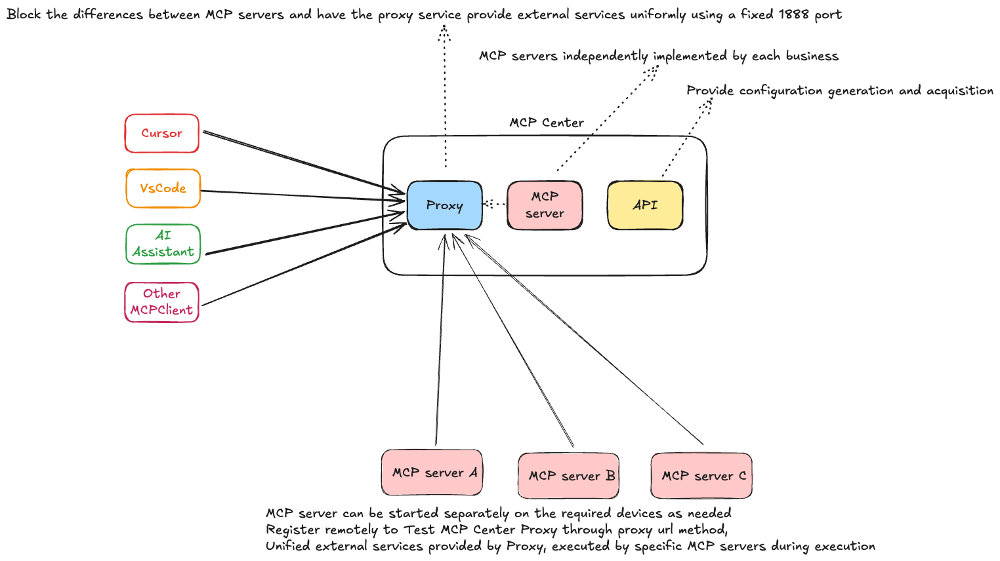
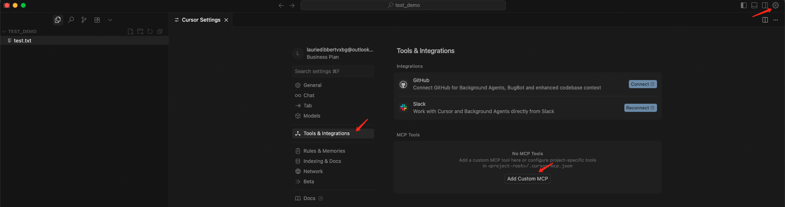
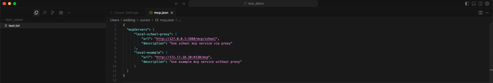
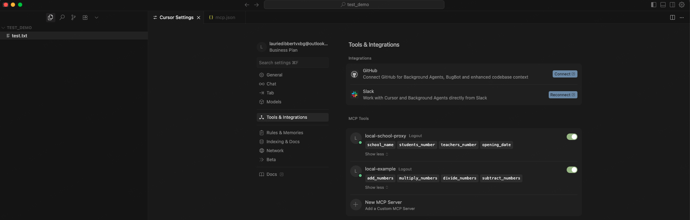
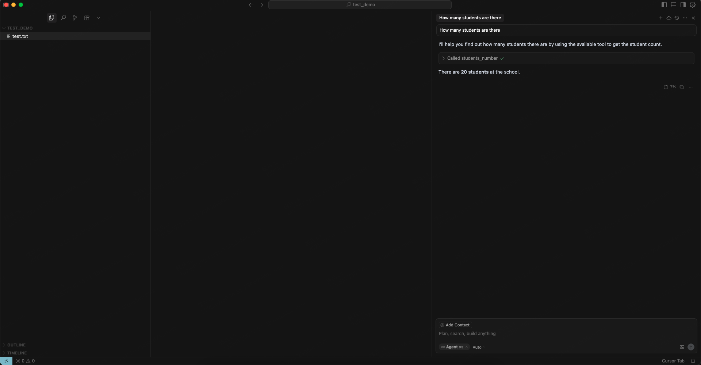

# LiteMCP Framework

中文 | [English](../README.md)

一个简单的 Model Context Protocol (MCP) 服务器框架，专为解决当前 MCP 服务器集群中节点分散、管理混乱、访问入口不统一等问题设计，提供简洁高效的工具开发与管控模式。

LiteMCP Framework 全面支持 Windows、macOS 和 Linux 三大操作系统，确保跨平台环境下的一致体验，核心优势包括：
- 快速创建自定义测试工具，降低多服务器场景下的工具开发成本
- 标准化 MCP 协议实现，解决分散节点间的协议兼容问题
- 灵活支持多种部署模式，适配不同规模的服务器集群
- 架构简单易扩展，轻松应对动态增长的服务器数量
- 内置智能代理服务器，整合分散节点为统一访问入口，终结多服务器管理杂乱的痛点

## 🚀 快速开始

### 🛠️ 开发环境准备

- **Python 3.12+**，多版本Python可以考虑使用[pyenv](https://github.com/pyenv/pyenv)等工具进行管理
- **pip** 或 **[Poetry](https://python-poetry.org/)**（推荐）
- **Git**（用于版本控制）

### 安装依赖

```bash
# 克隆项目
git clone https://github.com/stonehill-2345/lite-mcp
cd lite-mcp

# 安装依赖（自动检测Poetry或pip）
./scripts/manage.sh setup

# 验证安装
./scripts/manage.sh check
```

### 管理脚本说明
| 操作系统        | 推荐管理脚本                | Python要求 |
|-------------|-----------------------|-----------|
| **Linux**   | `./scripts/manage.sh` | Python 3.12+ |
| **macOS**   | `./scripts/manage.sh` | Python 3.12+ |
| **Windows** | `scripts\manage.bat`  | Python 3.12+ |
| **全平台通用**   | `./scripts/manage.py` | Python 3.12+ |

获取使用参数说明：
```bash
python ./scripts/manage.py help
./scripts/manage.sh help  # 或
./scripts/manage.bat help  # 或

# 管理脚本的核心是cli.py，你甚至可以直接使用cli.py
python src/cli.py serve --server example --transport sse --port 8000
```

### 基础用法
> **注意**：根据自己的系统选择对应的管理脚本或直接使用`manage.py`，以下示例均在Mac OS环境下使用`manage.sh`完成。

```bash
# 安装依赖 或 install
./scripts/manage.sh setup

# 启动所有服务(启用状态的mcp server、mcp api、mcp proxy), 根据项目的[servers.yaml](config/servers.yaml) 中的配置而定自动启动enabled为true的服务
./scripts/manage.sh up

# 查看启动状态及访问地址等信息
./scripts/manage.sh ps

# 停止所有服务
./scripts/manage.sh down

# 重启所有服务，up参数相同效果
./scripts/manage.sh restart
```

### 进阶用法
```bash
# 仅启动mcp api
./scripts/manage.sh api

# 仅启动mcp proxy
./scripts/manage.sh proxy

# 启动指定服务(具体服务名称根据[__init__.py](src/tools/__init__.py)配置而定) 或 start
./scripts/manage.sh up --name <server name>

# 停止指定服务 或 stop
./scripts/manage.sh down --name <server name>

# 输出详细debug日志，在任意管理操作后面添加--verbose参数即可查看过程中产生的debug日志信息
./scripts/manage.sh down --name <server name> --verbose

# 重启指定服务，up参数相同效果
./scripts/manage.sh restart --name <server name>

# 将mcp server注册到指定mcp proxy由指定的mcp proxy统一提供对外服务
./scripts/manage.sh start --name example --proxy-url https://test-mcp.2345.cn  # 启动指定服务并注册到指定代理

# 注销所有服务
./scripts/manage.sh unregister --proxy-url https://test-mcp.2345.cn
```
> 需要注意：注册到远程代理服务主要适用于类似Jenkins的 多salve、一个master的模式，注册到远程代理时，如果远程代理也启动这个服务则会覆盖代注册服务信息。
!

> 剩余非核心参数用法可使用 `./scripts/manage.sh help` 自行发掘。

### 💡 平台特定说明

#### Windows 用户注意事项
1. **Python环境**：确保已安装Python 3.12+并添加到PATH环境变量
   ```cmd
   python --version
   ```

2. **包装器脚本**：现在可以使用 `scripts\manage.bat` 获得与Linux/macOS一致的体验

3. **多种Python命令**：包装器会自动检测 `python`、`python3` 或 `py` 命令

#### macOS/Linux 用户注意事项
1. **执行权限**：确保脚本有执行权限
   ```bash
   chmod +x scripts/manage.sh
   ```
2. **系统命令**：脚本会自动检测操作系统并使用相应的命令


## 🎯 配置mcp client示例

### 📱 客户端配置

#### 获取client配置

**⚠️操作须知：** 在调用接口获取前必须已经启动api server(影响获取配置但不影响stdio模式使用)，否则不能直接调用接口获取配置信息
* 第一种方式：直接运行：[api_server.py](../src/core/api_server.py)。注：此方式只对stdio模式有效，sse http mcp server均未启动。
* 第二种方式：通过cli启动：`python src/cli.py api`。注：此方式只对stdio模式有效，sse http mcp server均未启动。
* 第三种方式：使用管理脚本启动api server：`./scripts/manage.sh api`。注：此方式只对stdio模式有效，sse http mcp server均未启动。
* 第四种方式：直接执行前面提到的`./scripts/manage.sh up`。注：此方式会启动所有启用的`mcp server`、`api server`、`proxy server`。
* 第五种方式：
  * python ./scripts/manage.py api  # 启动api
  * python ./scripts/manage.py proxy  # 启动代理
  * python ./scripts/manage.py up --name xxx  # 启动指定服务

**第一种方式：** 直接通过接口获取配置
```curl
curl -X 'GET' \
  'http://{mcp api ip}:9000/config?client_type=cursor&format=json' \
  -H 'accept: application/json'
```

**第二种方式：** 通过fast api 提供的swagger页面获取(或)
浏览器打开 http://{启动服务的机器IP}:9000/docs#/default/get_mcp_config_config_get

**第三种方式：** 直接查看启动日志，日志中会展示proxy地址和mcp server启动地址和端口号

#### client配置内容说明
```json
{
    "sse-proxy": {
        "url": "https://{proxy ip}:1888/sse/pm",
        "description": "【走代理，sse模式启动】，proxy根据路径自动代理请求"
    },
   "http-proxy": {
        "url": "https://{proxy ip}:1888/mcp/pm",
        "description": "【走代理，Streamable HTTP模式启动】，proxy根据路径自动代理请求"
    },
   "sse": {
        "url": "https://{mcp server ip}:8765/sse",
        "description": "【不走代理，sse模式启动】，由具体的mcp sse server自行处理请求，不经过代理转发"
    },
    "mcp": {
        "url": "https://{mcp server ip}:8765/mcp",
        "description": "【不走代理，Streamable HTTP启动】，由具体的mcp http server自行处理请求，不经过代理转发"
    },
    "school-stdio": {
        "command": "/bab/.cache/pypoetry/virtualenvs/litemcp-bQXDpGYe-py3.12/bin/python3",
        "args": [
            "/home/bab/Code/litemcp/src/tools/demo/school_server.py"
        ],
        "env": {},
        "description": "【本地命令行模式】，由mcp client自行维护"
    }
}
```
> 注：不经过代理服务时，每次重新启动服务端口都可能发生变化需要自行根据变化情况调整。proxy默认端口为1888。

#### 配置cursor示例
配置工具路径示例：

配置内容示例：

启用工具示例：

使用工具示例：


### 服务器配置文件

> 此配置影响 [manage.sh](../scripts/manage.sh) 和 [manage.py](../scripts/manage.py) 等启动脚本具体启动哪些服务，及服务本身相关配置参数。
> 非通用性参数建议直接硬编码，通用一点的必要配置可以放到env文件。

`config/servers.yaml` 配置示例：

```yaml
# LiteMCP 服务器启动配置
mcp_servers:
  example:
    enabled: true                    # 是否启用该服务器
    server_type: "example"           # 服务器类型
    transport: "sse"                 # 传输协议: stdio/http/sse  
    host: null                       # 自动获取当前机器IP，外部可访问
    port: null                       # 端口号，null表示自动分配
    auto_restart: true               # 是否自动重启
    description: "示例服务器"

  school:
    enabled: true
    server_type: "school"
    transport: "sse"
    host: null                       # 自动获取当前机器IP，外部可访问
    port: null                       # 自动分配端口
    auto_restart: true
    description: "学校管理服务器"

# API服务器配置  
api_server:
  enabled: true                      # 是否启用API服务器
  host: null                         # 自动获取当前机器IP，外部可访问
  port: 9000                         # API服务器端口
  auto_restart: true                 # 是否自动重启
  description: "配置API服务器"
```

## 🏗️ 项目结构
- [项目结构](USAGE.zh_CN.md#-项目结构)

## 🔧 开发指南

### 创建新工具服务器

现在只需5步，无需修改CLI代码！

#### 1. 创建服务器文件
在 `tools/` 目录创建新的服务器文件

#### 2. 注册到框架
在 `tools/__init__.py` 中注册新服务器

#### 3. 配置启动参数
在 `config/servers.yaml` 中添加服务器配置

#### 4. 测试工具
使用 `./scripts/manage.sh up` 批量启动测试 或参考《[传统启动方式（开发调试）](README.zh_CN.md#进阶用法)》章节单独启动

#### 5. 验证功能
通过代理地址在MCP客户端中验证工具功能

### 示例实现

```python
"""
我的测试工具 - 简洁的开发模式
"""

from src.tools.base import BaseMCPServer
    

class MyTestServer(BaseMCPServer):
    """我的测试服务器 - 继承基础类"""
    
    def __init__(self):
        # 调用父类初始化，自动获得传输模式支持
        super().__init__("My-Test-Server")
    
    def _register_tools(self):
        """实现工具注册 - 专注业务逻辑"""
        
        @self.mcp.tool()
        def my_tool(param: str) -> str:
            """我的测试工具"""
            return f"处理: {param}"

# 创建实例
my_server = MyTestServer()

if __name__ == "__main__":
    # 自动支持所有传输模式：
    # my_server.run()       # STDIO模式
    # my_server.run_http()  # HTTP模式  
    # my_server.run_sse()   # SSE模式
    my_server.run()
```

## 🚨 故障排除

### 常见问题

```bash
# 端口冲突
./scripts/manage.sh down --force  # 强制停止所有服务器
./scripts/manage.sh up            # 重新启动

# 查看日志
./scripts/manage.sh log           # 查看所有日志文件
tail -f logs/example.log  # 实时查看特定日志

# 系统检查
./scripts/manage.sh check         # 健康检查
./scripts/manage.sh setup         # 重新安装依赖

# 详细调试
./scripts/manage.sh up --verbose  # 显示详细启动信息
./scripts/manage.sh diagnose      # 运行系统诊断
```

🔧 **详细故障排除指南**: 查看 [USAGE.zh_CN.md](USAGE.zh_CN.md#-故障排除) 获取完整的诊断方法和解决方案

## 📚 完整文档导航

### 🚀 快速入门文档
- **[5分钟快速开始](USAGE.zh_CN.md#-快速开始)** - 环境准备到工具调用
- **[代理服务器详解](USAGE.zh_CN.md#-代理服务器详解)** - 智能代理的架构和使用

### 🛠️ 开发者文档
- **[开发新工具](USAGE.zh_CN.md#-开发新工具)** - 5步创建自定义工具
- **[传输模式详解](USAGE.zh_CN.md#-传输模式详解)** - STDIO、HTTP、SSE、代理模式
- **[项目结构说明](USAGE.zh_CN.md#-项目结构)** - 完整的目录结构和文件说明

### 🔧 运维管理文档
- **[完整命令列表](USAGE.zh_CN.md#-完整命令列表)** - 所有管理命令详解
- **[配置文件详解](USAGE.zh_CN.md#-配置文件)** - servers.yaml完整配置说明
- **[故障排除指南](USAGE.zh_CN.md#-故障排除)** - 常见问题和解决方案

### 📖 核心功能文档
- **[智能代理服务器](USAGE.zh_CN.md#-代理服务器详解)** - 架构原理、配置、诊断
- **[常见操作场景](USAGE.zh_CN.md#-常见操作场景)** - 开发、生产、维护场景
- **[常见问题FAQ](USAGE.zh_CN.md#-常见问题)** - 详细的问答集合

💡 **使用建议**：
 - 新用户：先看本 README，然后查看 [5分钟快速开始](USAGE.zh_CN.md#-快速开始)
 - 开发者：重点查看 [开发新工具](USAGE.zh_CN.md#-开发新工具) 章节
 - 运维人员：参考 [故障排除指南](USAGE.zh_CN.md#-故障排除) 和命令列表

### 内置示例服务

| 服务器类型 | 描述 | 用途 |
|-----------|------|------|
| `example` | 示例工具服务器 | 开发模式展示、标准化实现 |
| `school` | 学校管理服务器 | 学生信息管理、数据操作示例 |

### 传输协议支持

- **STDIO**: 标准输入输出模式，适用于本地开发由具体的mcp client管理mcp server
- **HTTP**: RESTful API模式，适用于网络部署（自动显示本地和外部访问地址）
- **SSE**: Server-Sent Events模式，适用于Web集成（自动显示本地和外部访问地址）
- **代理模式**: 统一访问入口，屏蔽具体mcp server动态变化的端口由路径自动匹配转发，**强烈推荐**

## 🤝 社区集成

LiteMCP Framework 集成了以下开源项目和库，为 MCP 服务器开发提供全面的开发体验：

### 核心依赖
- **[fastmcp](https://github.com/jlowin/fastmcp)** - Python 的快速 Model Context Protocol 实现
- **[fastapi](https://fastapi.tiangolo.com/)** - 现代、快速的 Python Web 框架，用于构建 API
- **[uvicorn](https://www.uvicorn.org/)** - 闪电般快速的 ASGI 服务器实现
- **[click](https://click.palletsprojects.com/)** - 用于创建美观命令行界面的 Python 包
- **[rich](https://rich.readthedocs.io/)** - 用于美化终端输出的 Rich 库

### 系统与网络
- **[psutil](https://psutil.readthedocs.io/)** - 跨平台库，用于获取运行进程信息和系统利用率
- **[httpx](https://www.python-httpx.org/)** - Python 的全功能 HTTP 客户端，支持同步和异步 API
- **[requests](https://requests.readthedocs.io/)** - 为人类设计的 Python HTTP 库

### 数据处理与安全
- **[PyYAML](https://pyyaml.org/)** - Python 的 YAML 解析器和发射器
- **[pycryptodome](https://pycryptodome.readthedocs.io/)** - Python 加密库
- **[chardet](https://chardet.readthedocs.io/)** - 通用字符编码检测器

### 数据库与工具
- **[pymysql](https://pymysql.readthedocs.io/)** - 纯 Python MySQL 客户端库
- **[apkutils2](https://github.com/avast/apkutils)** - Android APK 文件解析器和工具

### 开发与测试
- **[pytest](https://docs.pytest.org/)** - Python 编写和运行测试的框架
- **[pytest-asyncio](https://pytest-asyncio.readthedocs.io/)** - 用于测试异步代码的 Pytest 插件

### 贡献指南
我们欢迎社区贡献！如果您想为 LiteMCP Framework 做出贡献：

1. Fork 该仓库
2. 创建功能分支
3. 进行您的更改
4. 为新功能添加测试
5. 提交 Pull Request


### 许可证
本项目采用 MIT 许可证 - 详情请参阅 [LICENSE](../LICENSE) 文件。


