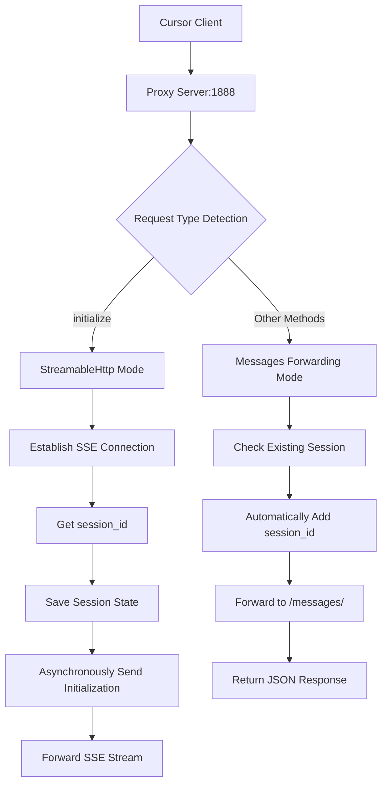

# LiteMCP Framework Complete Usage Guide

## 🎯 Overview

A simple Model Context Protocol (MCP) server framework designed to solve issues like scattered nodes, management chaos, and inconsistent access points in current MCP server clusters, providing a concise and efficient tool development and management model.

## 📋 Table of Contents

1. [Quick Start](#-quick-start)
2. [Proxy Server Details](#-proxy-server-details)
3. [Complete Command List](#-complete-command-list)
4. [Configuration Files](#-configuration-files)
5. [Transport Mode Details](#-transport-mode-details)
6. [Developing New Tools](#-developing-new-tools)
7. [Project Structure](#-project-structure)
8. [Common Operation Scenarios](#-common-operation-scenarios)
9. [Troubleshooting](#-troubleshooting)
10. [Frequently Asked Questions](#-frequently-asked-questions)

## 🚀 Quick Start

### Get Started with LiteMCP in 5 Minutes

#### 1. Environment Setup

**System Requirements**:
- Python 3.12+
- Operating System: Windows, macOS, Linux

**Installation Steps**:
```bash
# Clone project
git clone https://github.com/stonehill-2345/lite-mcp
cd lite-mcp

# Install dependencies (auto-detect Poetry or pip)
./scripts/manage.sh setup

# Verify installation
./scripts/manage.sh check
```

#### 2. Simplest Startup Method (Recommended)

**🎯 One-click startup of all services (including proxy server)**:
```bash
# One-click startup: Proxy server + MCP servers + API server
./scripts/manage.sh up

# View server status  
./scripts/manage.sh ps
```

#### 3. Configure MCP Client

**HTTP configuration example (requires starting mcp server in http mode)**:
```json
{
  "mcpServers": {
    "example-proxy-http": {
      "url": "http://{server ip}:1888/mcp/example",
      "description": "Example MCP server, demonstrating basic functionality (accessed via proxy HTTP)"
    },
    "school-proxy-http": {
      "url": "http://{server ip}:1888/mcp/school",
      "description": "School management MCP server, providing student and course management functionality (accessed via proxy HTTP)"
    },
    "school-http": {  // When not using proxy, configure specific http port
        "url": "http://{server ip}:8765/mcp",
        "description": "School management MCP server, providing student and course management functionality (accessed via proxy HTTP)"
    }
  }
}
```
> Modify the specific IP+port according to your server's actual situation.

**SSE configuration example (requires starting mcp server in sse mode)**:
```json
{
  "mcpServers": {
    "example-proxy-sse": {
        "url": "http://{server ip}:1888/sse/example",
        "description": "Example MCP server, demonstrating basic functionality (accessed via proxy SSE)"
    },
    "school-proxy-sse": {
        "url": "http://{server ip}:1888/sse/school",
        "description": "School management MCP server, providing student and course management functionality (accessed via proxy SSE)"
    },
    "school-sse": {  // When not using proxy, configure specific sse port
        "url": "http://{server ip}:8765/sse",
        "description": "School management MCP server, providing student and course management functionality (accessed via proxy SSE)"
    }
  }
}
```
> Modify the specific IP+port according to your server's actual situation. Used when no local Python environment is available, SSE is a long connection, and if interruption occurs, the client needs to re-establish connection (e.g., with Cursor: after disconnection, you need to refresh to get the tool list again).

**STDIO configuration example (local recommended, no need to start service)**:
```json
{
    "mcpServers": {
        "example-stdio": {
            "command": "/Users/bab/devops/ai/litemcp/.venv/bin/python",
            "args": [
                "/Users/bab/devops/ai/litemcp/src/tools/demo/example_server.py"
            ],
            "env": {},
            "description": "Example MCP server, demonstrating basic functionality"
        },
        "school-stdio": {
            "command": "/Users/bab/devops/ai/litemcp/.venv/bin/python",
            "args": [
                "/Users/bab/devops/ai/litemcp/src/tools/demo/school_server.py"
            ],
            "env": {},
            "description": "School management MCP server, providing student and course management functionality"
        }
    }
}
```
> Modify the specific path according to your server's actual situation. Requires local Python environment and corresponding MCP server code. No disconnection issues, can maintain continuous usage.


See [MCP client configuration example](../README.md#-client-configuration) for details.

**✨ Advantages of Proxy Server**:
- 🔗 **Fixed Port Access**: Configure once on client, never changes
- 🧠 **Intelligent Protocol Handling**: Automatically manages StreamableHttp complexity
- 🔄 **Automatic Session Management**: Transparently handles session_id state
- 🚀 **Zero Configuration Experience**: MCP servers automatically register with proxy

## 🌟 Proxy Server Details

### Why Do We Need a Proxy Server?

**Problems with Traditional Approach**:
- 🔴 Dynamic port allocation, frequent client configuration changes
- 🔴 StreamableHttp protocol complexity, requires manual session_id management
- 🔴 Each MCP server needs separate configuration

**Proxy Server Solution**:
- ✅ Unified access entry (fixed port 1888)
- ✅ Intelligent protocol handling (automatically distinguishes initialization and regular requests)
- ✅ Transparent session management (clients don't need to care about session_id)
- ✅ Automatic service discovery (MCP servers automatically register)

### 🔧 Architecture Principles

StreamableHttp Processing Flow:


### 🌐 Access Path Rules

```
# Unified Access Entry
http://{server ip}:1888/sse/{server_name}    -> Intelligent Protocol Processing
http://{server ip}:1888/mcp/{server_name}/*  -> HTTP Protocol Forwarding

# Management Interfaces
http://{server ip}:1888/proxy/status         -> Proxy Status Query
http://{server ip}:1888/proxy/mapping        -> Server Mapping Query
http://{server ip}:1888/proxy/register       -> Manual Server Registration
```

### 🔧 Proxy Server Configuration Details

#### Configuration Parameter Description

| Parameter | Type | Description | Recommended Value |
|-----------|------|-------------|-------------------|
| `enabled` | boolean | Whether to enable proxy server | `true` |
| `host` | string | Listening host address, "0.0.0.0" supports external network access | `"0.0.0.0"` |
| `port` | int | Proxy server fixed port | `1888` |
| `timeout` | int | HTTP request timeout (seconds) | `30` |
| `connect_timeout` | int | Connection timeout (seconds) | `10` |
| `mcp_prefix` | string | MCP HTTP path prefix | `"mcp"` |
| `sse_prefix` | string | SSE path prefix | `"sse"` |

Through LiteMCP reverse proxy, you can focus on MCP tool business logic development without worrying about complex protocol details and network configuration.

## 📋 Startup Methods Details

### 🚀 One-Click Startup (Recommended for Production Environment)

**Super Simple Method (Recommended for Daily Use)**:
```bash
# One-click startup of all servers (including proxy)
./scripts/manage.sh up

# View server status  
./scripts/manage.sh ps

# One-click stop all servers
./scripts/manage.sh down

# Restart all servers
./scripts/manage.sh restart
```

### 🔧 Individual Startup (Recommended for Development Debugging)

**STDIO Mode (Local Development, No Need to Start Server)**:
```bash
# STDIO mode doesn't need to start server, just configure MCP client directly
echo "STDIO mode: Configure MCP client directly, no need to pre-start server"
```

**HTTP Mode (Network Access)**:
```bash
# Use cli to start single server - Example server
python src/cli.py serve --server example --transport http

# Use cli to start single server - School server  
python src/cli.py serve --server school --transport http

# Use cli to specify port startup
python src/cli.py serve --server example --transport http --port 8001
```

**SSE Mode (Web Integration)**:
```bash
# Use cli to start single server - Example server
python src/cli.py serve --server example --transport sse

# Use cli to start single server - School server
python src/cli.py serve --server school --transport sse

# Use cli to specify port startup
python src/cli.py serve --server example --transport sse --port 8002
```

### 📊 View Available Servers

```bash
python src/cli.py list
```

Expected Output:
```
┏━━━━━━━━━━━━┳━━━━━━━━━━━━━━━━━━━━━━━━━━━━━━━━━━━━━━┳━━━━━━━━━━━━━━━━━━━━━━━━━━━━━━┓
┃ Server     ┃ Description                          ┃ Tool Examples                 ┃
┡━━━━━━━━━━━━╇━━━━━━━━━━━━━━━━━━━━━━━━━━━━━━━━━━━━━━╇━━━━━━━━━━━━━━━━━━━━━━━━━━━━━━┩
│ example    │ Example tool server - demonstrates standard development pattern │ add_numbers, multiply_numbers │
│ school     │ School management server - student information management      │ add_student, get_students     │
└────────────┴────────────────────────────────────┴──────────────────────────────┘
```

### 📈 Transport Mode Selection Guide

| Mode | Startup Method | Applicable Scenarios | Configuration Complexity | Recommended Usage |
|------|----------------|---------------------|-------------------------|-------------------|
| **STDIO** | No need to start server | Local development, Claude Desktop, Cursor | ⭐ Simple | First-time testing |
| **HTTP** | `python src/cli.py serve --server <name> --transport http` | Network deployment, remote access | ⭐⭐ Medium | API integration |
| **SSE** | `python src/cli.py serve --server <name> --transport sse` | Web integration, browser connection | ⭐⭐ Medium | Real-time applications |
| **Proxy Mode** | `./scripts/manage.sh up` | Production deployment, team sharing | ⭐ Simple | **🌟 Strongly Recommended** |

**💡 Usage Recommendations**:
- **Local Usage**: Recommend STDIO mode for quick experience
- **Team Collaboration**: Use proxy mode, unified access entry
- **Production Deployment**: Use proxy mode + `./scripts/manage.sh up`

## 📋 Complete Command List
### ⚡ Quick Commands (Recommended for Daily Use)

| Command  | Function           | Example |
|----------|-------------------|---------|
| `up`     | 🚀 Start all servers      | `./scripts/manage.sh up` |
| `down`   | ⏹️ Stop all servers       | `./scripts/manage.sh down` |
| `reboot` | 🔄 Restart all servers    | `./scripts/manage.sh reboot` |
| `ps`     | 📊 View server status     | `./scripts/manage.sh ps` |
| `log`    | 📝 View log information   | `./scripts/manage.sh log` |
| `check`  | ❤️ System health check    | `./scripts/manage.sh check` |
| `setup`  | 📦 Install/update dependencies | `./scripts/manage.sh setup` |
| `clear`  | 🧹 Clean temporary files  | `./scripts/manage.sh clear` |
| `conf`   | ⚙️ View configuration info | `./scripts/manage.sh conf` |
| `api`    | 🚀 Start API service only | `./scripts/manage.sh api` |
| `proxy`  | 🚀 Start proxy service only | `./scripts/manage.sh proxy` |

### 📋 Detailed Commands (Recommended for Script Usage)

| Command | Function | Example |
|---------|----------|---------|
| `start` | Start all servers | `./scripts/manage.sh start` |
| `stop` | Stop all servers | `./scripts/manage.sh stop --force` |
| `restart` | Restart all servers | `./scripts/manage.sh restart` |
| `status` | View server status | `./scripts/manage.sh status` |
| `install` | Install/update dependencies | `./scripts/manage.sh install` |
| `logs` | View log list | `./scripts/manage.sh logs` |
| `clean` | Clean logs and PID files | `./scripts/manage.sh clean` |
| `health` | System health check | `./scripts/manage.sh health` |
| `config` | Display current configuration | `./scripts/manage.sh config` |

### 🎯 Specified Server Management (New Feature)

Supports specifying individual servers to operate through `--name` or `-n` parameters:

| Command | Function | Example |
|---------|----------|---------|
| `up --name <server>` | 🚀 Start specified server | `./scripts/manage.sh up --name example` |
| `down -n <server>` | ⏹️ Stop specified server | `./scripts/manage.sh down -n school` |
| `reboot --name <server>` | 🔄 Restart specified server | `./scripts/manage.sh reboot --name pm` |
| `start -n <server>` | Start specified server | `./scripts/manage.sh start -n sonic` |
| `stop --name <server>` | Stop specified server | `./scripts/manage.sh stop --name fastbot` |
| `restart -n <server>` | Restart specified server | `./scripts/manage.sh restart -n example` |

#### Usage Examples

```bash
# Start specified server (two formats are equivalent)
./scripts/manage.sh up --name example
./scripts/manage.sh up -n example

# Stop specified server
./scripts/manage.sh down --name school
./scripts/manage.sh down -n school

# Restart specified server (commonly used during development)
./scripts/manage.sh reboot --name school
./scripts/manage.sh restart -n school

# Start all servers (maintains original functionality)
./scripts/manage.sh up
```

#### Application Scenarios

1. **Developing New Service**: After adding a new service, only start that service for testing
   ```bash
   ./scripts/manage.sh up --name my_new_server
   ```

2. **Modifying Existing Service**: After modifying a service's code, only restart that service
   ```bash
   ./scripts/manage.sh reboot --name example
   ```

3. **Debugging Specific Service**: When debugging a service, operate on it individually
   ```bash
   ./scripts/manage.sh down --name problematic_server
   ./scripts/manage.sh up --name problematic_server
   ```

4. **Resource Conservation**: During development, don't need to start all services
   ```bash
   ./scripts/manage.sh up -n example  # Only start needed services
   ```

### Option Parameters

| Option | Function | Example |
|--------|----------|---------|
| `--name, -n <service_name>` | Specify the server name to operate on | `./scripts/manage.sh up --name example` |
| `--force` | Force execute operation | `./scripts/manage.sh stop --force` |
| `--verbose` | Display detailed output (including port allocation debug information) | `./scripts/manage.sh up --verbose` |
| `--dry-run` | Only display operation, don't execute | `./scripts/manage.sh start --dry-run` |

### 🔧 Debugging and Troubleshooting Commands

| Command | Function | Application Scenario | Example |
|---------|----------|---------------------|---------|
| `up --verbose` | Start and display detailed debug information | Troubleshoot startup failures, port allocation issues | `./scripts/manage.sh up --verbose` |
| `start --verbose` | Display port allocation details during startup | Debug port conflicts, IP acquisition issues | `./scripts/manage.sh start --verbose` |
| `start --verbose -n <server>` | Debug specific server startup process | Individual server fault troubleshooting | `./scripts/manage.sh start --verbose -n example` |
| `diagnose` | Run complete system diagnosis | Environment issues, port allocation anomalies | `./scripts/manage.sh diagnose` |

#### Detailed Mode Function Description

**The `--verbose` parameter will display the following debug information**:
- **Environment Information**: Operating system, Python version, network interface status
- **Port Allocation Process**: Complete execution process of intelligent port allocation
- **Module Import Status**: Python module loading and dependency checking
- **Server Configuration**: Detailed configuration parameters for each server
- **Registry Operations**: Detailed process of server registration and cleanup

**Typical Usage Scenarios**:
1. **First Deployment**: Verify environment configuration and dependencies
   ```bash
   ./scripts/manage.sh up --verbose
   ```

2. **Port Conflict Troubleshooting**: View port allocation logic
   ```bash
   ./scripts/manage.sh start --verbose -n example
   ```

3. **Production Environment Failures**: Get detailed error information
   ```bash
   ./scripts/manage.sh diagnose
   ```

4. **Development Debugging**: Verify new server configuration
   ```bash
   ./scripts/manage.sh start --verbose -n my_new_server
   ```

### CLI Commands (Individual Usage)

| Command | Function | Example |
|---------|----------|---------|
| `python src/cli.py list` | View all available servers | `python src/cli.py list` |
| `python src/cli.py serve` | Start single server | `python src/cli.py serve --server example` |
| `python src/cli.py health` | System health check | `python src/cli.py health` |

## ⚙️ Configuration Files

The configuration file is located in the root directory `config/servers.yaml`, defining the servers to be started:

```yaml
# LiteMCP Server Startup Configuration
# This configuration file defines all MCP servers, proxy server, and API server to be started

# Reverse Proxy Server Configuration
proxy_server:
  enabled: true                      # Whether to enable proxy server
  host: "0.0.0.0"                   # Bind all network cards, supports external network access
  port: 1888                         # Proxy server fixed port
  timeout: 30                        # HTTP request timeout
  connect_timeout: 10                # Connection timeout
  mcp_prefix: "mcp"                  # MCP HTTP path prefix
  sse_prefix: "sse"                  # SSE path prefix
  description: "MCP reverse proxy server, supports StreamableHttp protocol"

# MCP Server Configuration
mcp_servers:
  example:
    enabled: true                    # Whether to enable this server
    server_type: "example"           # Server type (corresponds to AVAILABLE_SERVERS key)
    transport: "sse"                 # Transport protocol: stdio/http/sse  
    host: null                       # Automatically get current machine IP, externally accessible
    port: null                       # Port number, null means auto-assign
    auto_restart: true               # Whether to auto-restart
    description: "Example server"

  school:
    enabled: true
    server_type: "school"
    transport: "sse"
    host: null                       # Automatically get current machine IP, externally accessible
    port: null                       # Auto-assign port
    auto_restart: true
    description: "School management server"

# API Server Configuration  
api_server:
  enabled: true                      # Whether to enable API server
  host: null                         # Automatically get current machine IP, externally accessible
  port: 9000                         # API server port
  auto_restart: true                 # Whether to auto-restart
  description: "Configuration API server"

# Global Configuration
global:
  project_name: "LiteMCP"            # Project name
  log_dir: "logs"                    # Log directory
  pid_dir: "pids"                    # PID file directory
  python_cmd: "python"               # Python command
  max_startup_wait: 30               # Maximum startup wait time (seconds)
  health_check_interval: 5           # Health check interval (seconds)
```

### Proxy Server Configuration Description

| Parameter | Type | Description | Recommended Value |
|-----------|------|-------------|-------------------|
| `enabled` | boolean | Whether to enable proxy server | `true` |
| `host` | string | Listening host address, "0.0.0.0" supports external network access | `"0.0.0.0"` |
| `port` | int | Proxy server fixed port | `1888` |
| `timeout` | int | HTTP request timeout (seconds) | `30` |
| `connect_timeout` | int | Connection timeout (seconds) | `10` |
| `mcp_prefix` | string | MCP HTTP path prefix | `"mcp"` |
| `sse_prefix` | string | SSE path prefix | `"sse"` |

### Automatic IP Acquisition Feature

**New Feature**: When configuring `host: null`, the system will automatically acquire the current machine's IP address, making servers accessible externally.

**Configuration Example**:
```yaml
mcp_servers:
  example:
    host: null          # Automatically get machine IP, e.g., 192.168.1.100
    port: null          # Auto-assign port, e.g., 8001
```

**Startup Effect**:
```bash
./scripts/manage.sh up
# ✅ Automatically acquired machine IP: 192.168.1.100
# ✅ Assigned port for server example: 8001
# ✅ example started successfully (PID: 12345)
...
```

**Traditional Configuration Comparison**:
```yaml
# Traditional method (local access only)
host: "localhost"       # Can only access locally
port: 8000             # Manually specify port

# New method (externally accessible)
host: null             # Automatically get machine IP
port: null             # Auto-assign port
```

### Configuration Parameter Description

| Parameter | Type | Description | Example |
|-----------|------|-------------|---------|
| `enabled` | boolean | Whether to enable this server | `true` / `false` |
| `server_type` | string | Server type, corresponds to registration name in `tools/__init__.py` | `"example"` |
| `transport` | string | Transport protocol | `"stdio"` / `"http"` / `"sse"` |
| `host` | string/null | Listening host address, `null` means automatically get machine IP | `"localhost"` / `null` |
| `port` | int/null | Listening port, `null` means auto-assign | `8000` / `null` |
| `auto_restart` | boolean | Whether to auto-restart (reserved feature) | `true` |
| `description` | string | Server description | `"Example server"` |

## 🌐 Transport Mode Details

### STDIO Mode

**Features**:
- Standard input/output communication
- No need to start server process
- Suitable for local development and desktop applications

**Usage Scenarios**:
- Claude Desktop integration
- Cursor IDE integration
- Local development debugging

**Configuration Example**:
```bash
# No need to pre-start, directly configure MCP client
python src/cli.py serve --server example  # For testing only
```

### HTTP Mode

**Features**:
- RESTful API interface
- Supports network access
- Standard HTTP protocol

**Usage Scenarios**:
- Remote service deployment
- Microservice architecture
- API integration

**Startup Example**:
```bash
# Start HTTP server (external access address will be displayed automatically)
python src/cli.py serve --server example --transport http

# Or use management script to start all servers
./scripts/manage.sh up
```

### SSE Mode

**Features**:
- Server-Sent Events
- Real-time data push
- Web-friendly

**Usage Scenarios**:
- Web application integration
- Real-time data streams
- Browser clients

**Startup Example**:
```bash
# Start SSE server (external access address will be displayed automatically)
python src/cli.py serve --server example --transport sse

# Or use management script to start all servers
./scripts/manage.sh up
```

### Test Connection

After starting the MCP client, you should see:
- ✅ litemcp-example server connection successful
- ✅ Available tools: add_numbers, multiply_numbers

Try in the AI client:
```
Please help me calculate 15 + 25
Please calculate 3.14 × 2
```

## 🛠️ Developing New Tools

### Complete Development Process

The following is the complete 5-step process for adding new tools:

#### Step 1: Create Server File

Create a new server file in the `tools/` directory, for example `my_tool_server.py`:

```python
"""
My Custom Tool - Describe your tool functionality
"""

# Concise import - Base class automatically handles path issues
try:
    from src.tools.base import BaseMCPServer
except ImportError:
    from src.tools.base import BaseMCPServer

class MyToolMCPServer(BaseMCPServer):
    """My custom tool server"""
    
    def __init__(self, name: str = "LiteMCP-MyTool"):
        # Call parent class initialization, automatically get all transport mode support
        super().__init__(name)
    
    def _register_tools(self):
        """Implement tool registration - This is the only method that needs to be implemented"""
        
        @self.mcp.tool()
        def my_function(input_text: str) -> str:
            """
            My custom tool function
            
            Args:
                input_text: Input text
            
            Returns:
                Processed result
            """
            # Implement your tool logic here
            return f"Processed result: {input_text}"

# Create global instance
my_tool_server = MyToolMCPServer()

if __name__ == "__main__":
    my_tool_server.run()
```

**🎯 Minimalist Development Mode**:
- ✅ Only 4 lines of import code (automatically handles paths)
- ✅ Automatically get STDIO, HTTP, SSE three transport modes
- ✅ Unified error handling mechanism
- ✅ Focus on business logic implementation
- ✅ Copy `tools/demo/example_server.py` as development starting point

#### Step 2: Register to Framework

Register the new server in `tools/__init__.py`:

```python
# Add to AVAILABLE_SERVERS dictionary
"my_tool": {
    "description": "My custom tool",
    "module": "tools.my_tool_server", 
    "class": "MyToolMCPServer"
}

# Add import (if direct import is needed)
from .my_tool_server import MyToolMCPServer

# Update __all__ list (if needed)
__all__ = [
    "AVAILABLE_SERVERS",
    "ExampleMCPServer",
    "MyToolMCPServer"  # New addition
]
```

**🚀 New Feature: Dynamic Tool Discovery**
- ✅ **No need to manually maintain tools list**: Framework automatically detects registered tools
- ✅ **Real-time updates**: Tools list stays synchronized with actual code
- ✅ **Reduced maintenance burden**: Only need to implement `_register_tools()` method

#### Step 3: Configure Startup Parameters

Add new server configuration in `servers.yaml` (if using manage.sh startup, recommended for server deployment):

```yaml
mcp_servers:
  # ... existing configuration ...
  
  my_tool:                           # New server
    enabled: true                    # Whether to enable
    server_type: "my_tool"           # Corresponds to registry key
    transport: "sse"                 # Transport protocol
    host: null                       # Auto-get machine IP
    port: null                       # Auto-assign port
    auto_restart: true
    description: "My custom tool"
```

**🚀 Framework Features**:
- ✅ **Dynamic server discovery**: No need to modify CLI code, automatically discover new servers
- ✅ **Configuration-driven startup**: Control startup parameters through `servers.yaml`
- ✅ **Zero code modification**: Adding new servers doesn't require modifying core code

#### Step 4: Test Tool

```bash
# View new tool
python src/cli.py list

# Start new server (individual testing, independent of servers.yaml configuration)
python src/cli.py serve --server my_tool

# manage.sh specifically determines which services to start and in what form based on servers.yaml configuration
# Batch startup (if the newly configured server's enabled is true, it includes the new server)
./scripts/manage.sh up

# View startup status
./scripts/manage.sh ps

# Health check
./scripts/manage.sh check
```

#### Step 5: Verify Functionality

**Method 1: Using Management Script (Recommended)**
```bash
# Start all servers (including new tool)
./scripts/manage.sh up

# View server status and access addresses
./scripts/manage.sh ps
```

**Method 2: MCP Client Configuration**
Add new tool in MCP client configuration:

```json
{
  "mcpServers": {
    "litemcp-my-tool": {
      "command": "python",
      "args": ["/path/to/litemcp/tools/my_tool_server.py"],
      "env": {}
    }
  }
}
```

### Development Best Practices

1. **Tool Naming**: Use clear, descriptive names
2. **Documentation Strings**: Provide detailed descriptions, parameter explanations, and return value explanations for each tool
3. **Error Handling**: Add appropriate exception handling in tool functions
4. **Type Hints**: Use Python type hints to improve code readability
5. **Test First**: Write unit tests for tools
6. **Configuration First**: Prioritize using `servers.yaml` configuration, support external access
7. **Automated Testing**: Use `./scripts/manage.sh up` for integration testing

## 📁 Project Structure

The following directories will be automatically created after startup:

```
litemcp/
├── config/                     # Configuration file directory
│   ├── servers.yaml            # Server configuration file
├── src/                        # Source code directory
│   ├── cli.py                  # Command line tool
│   ├── core/                   # Core modules
│   │   ├── config.py           # Configuration management
│   │   ├── utils.py            # Utility functions (including IP acquisition)
│   │   ├── registry.py         # Server registry
│   │   ├── proxy_server.py     # Proxy server core
│   │   └── api_server.py       # API server core
│   ├── controller/             # API controllers
│   │   ├── __init__.py         # Controller package initialization
│   │   └── config_api.py       # FastAPI interface
│   └── tools/                  # MCP tool servers
│       ├── __init__.py         # Server registry center
│       ├── base.py             # Base server class
│       └── demo/               # Custom server directory
│           ├── example_server.py   # Example server
│           ├── school_server.py    # School management server
├── docs/                      # Documentation directory
│   ├── USAGE.md               # Complete user guide
├── runtime/                   # Runtime files directory
│   ├── logs/                  # Log files
│   │   ├── example.log        # Example server log
│   │   ├── school.log         # School server log
│   │   └── api_server.log     # API server log
│   ├── pids/                  # PID files
│   │   ├── example.pid        # Example server PID
│   │   ├── school.pid         # School server PID
│   │   └── api_server.pid     # API server PID
│   ├── cache/                 # Cache files
│   └── registry.json          # Server registry (generated at runtime)
├── scripts/                   # Scripts directory
│   └── manage.sh              # Unified management script
├── tests/                     # Testing directory
│   ├── test_tools/            # Tool tests
├── cli.py                     # CLI starter (backward compatibility)
├── manage.sh                  # Management script starter
├── pyproject.toml             # Project configuration
└── README.md                  # Project description
```

### Core File Descriptions

- **`manage.sh`**: Unified management script, supports both quick and detailed command styles
- **`config/servers.yaml`**: Server configuration file, defines servers to be started
- **`src/cli.py`**: Command line interface, provides server management functions, supports dynamic import
- **`src/tools/__init__.py`**: Server registry, manages all available tools
- **`src/tools/base.py`**: Base server class, provides unified development framework
- **`src/tools/demo/example_server.py`**: Example server, demonstrates basic implementation pattern
- **`src/core/config.py`**: Global configuration management
- **`src/core/utils.py`**: Utility functions, includes automatic IP acquisition
- **`src/core/proxy_server.py`**: Proxy server core, intelligent protocol handling
- **`src/core/api_server.py`**: API server core, configuration management interface
- **`runtime/registry.json`**: Runtime server registry, automatically maintained

## 🔧 Common Operation Scenarios

### Scenario 1: Development Environment Startup

```bash
# One-click startup of development environment
./scripts/manage.sh up

# View all server status
./scripts/manage.sh ps

# View logs in real-time
tail -f logs/*.log
```

### Scenario 2: Specific Server Development (New Feature)

```bash
# Develop new service: Start only specified server for testing
./scripts/manage.sh up --name my_new_server

# Modify existing service: Restart specified server
./scripts/manage.sh reboot --name example

# Debug specific service: Stop then restart
./scripts/manage.sh down --name problematic_server
./scripts/manage.sh up --name problematic_server

# View specific server status
./scripts/manage.sh ps | grep example
```

### Scenario 3: Production Environment Deployment

```bash
# First install dependencies
./scripts/manage.sh setup

# Check system health
./scripts/manage.sh check

# Start all servers
./scripts/manage.sh start

# Verify server status
./scripts/manage.sh status
```

**Docker deployment**:
```dockerfile
FROM python:3.12-slim
COPY . /app
WORKDIR /app
RUN pip install -r requirements.txt
CMD ["./scripts/manage.sh", "up"]
```

### Scenario 4: Server Maintenance

```bash
# Update single server code and restart
./scripts/manage.sh reboot --name pm

# Batch restart all servers
./scripts/manage.sh reboot

# Stop specific server for maintenance
./scripts/manage.sh down --name sonic

# Restart after maintenance
./scripts/manage.sh up --name sonic
```

### Scenario 5: Troubleshooting

```bash
# Check system health
./scripts/manage.sh check

# View log file list
./scripts/manage.sh log

# View specific server log
tail -f logs/example.log

# Restart problematic server
./scripts/manage.sh reboot --name example
```

### Scenario 6: Cleaning and Maintenance

```bash
# Stop all servers
./scripts/manage.sh down

# Clean logs and temporary files
./scripts/manage.sh clear

# Update dependencies
./scripts/manage.sh setup

# Restart
./scripts/manage.sh up
```

### Scenario 7: Development Workflow (Recommended)

```bash
# 1. Development phase: Start only needed servers
./scripts/manage.sh up --name example

# 2. Testing phase: Start related servers
./scripts/manage.sh up --name school
./scripts/manage.sh up --name pm

# 3. Integration testing: Start all servers
./scripts/manage.sh up

# 4. After code modification: Restart specific server
./scripts/manage.sh reboot --name example

# 5. Pre-release verification: Check all service status
./scripts/manage.sh ps
./scripts/manage.sh check
```

### Scenario 8: Start Specific Server Individually

```bash
# Start single server (STDIO mode)
python src/cli.py serve --server example

# Start HTTP mode (network access)
python src/cli.py serve --server example --transport http

# Start SSE mode (Web integration)
python src/cli.py serve --server example --transport sse
```

## 🚨 Troubleshooting

### 🔧 Proxy Server Troubleshooting

#### 1. Proxy Server Failed to Start
**Symptoms**: `./scripts/manage.sh up` shows proxy startup failure

**Solutions**:
```bash
# Check port occupancy
netstat -tulpn | grep 1888

# Force clean port
sudo kill $(sudo lsof -t -i:1888)

# Restart
./scripts/manage.sh down && ./scripts/manage.sh up
```

#### 2. MCP Server Registration Failed
**Symptoms**: Proxy status shows `"total_servers": 0`

**Solutions**:
```bash
# Manual re-registration
curl -X POST http://{server ip}:1888/proxy/register \
  -H "Content-Type: application/json" \
  -d '{"server_name": "example", "host": "{server ip}", "port": 8000}'

# Check if MCP server is running
curl http://{server ip}:8000/sse
```

#### 3. Cursor Connection Failed
**Symptoms**: Cursor shows "MCP error -32602: Invalid request parameters"

**Solutions**:
- Ensure using external network IP instead of localhost
- Check if proxy server's session management is working properly
- View proxy logs for detailed error information

#### 4. StreamableHttp Protocol Issues
**Symptoms**: Tool list cannot load

**Solutions**:
```bash
# View proxy detailed logs
tail -f runtime/logs/proxy_server.log

# Check session management
curl http://{server ip}:1888/proxy/status | jq '.servers'
```

### 🔧 Debug Mode

**Use `--verbose` parameter to get detailed diagnostic information**:
```bash
# Enable detailed mode during startup (recommended for first use)
./scripts/manage.sh up --verbose

# Debug specific server
./scripts/manage.sh start --verbose -n example

# Run system diagnosis
./scripts/manage.sh diagnose
```

**Information displayed in detailed mode**:
- 🔍 **Environment check**: Python version, dependency status, network interfaces
- 🔧 **Port allocation details**: Complete execution process of intelligent port allocation
- 📊 **Configuration parsing**: Detailed configuration parameters for each server
- 🔄 **Registry operations**: Detailed process of server registration and cleanup
- 🐛 **Error diagnosis**: Detailed error stacks and suggested solutions

**Traditional debugging method**:
```bash
# Or start proxy server individually for debugging
python src/cli.py proxy --host 0.0.0.0 --port 1888 --log-level DEBUG
```

### 🔍 General Troubleshooting

### Port Conflict
The system automatically allocates available ports to avoid conflicts. If problems persist:
```bash
./scripts/manage.sh down --force  # Force stop all servers
./scripts/manage.sh up            # Restart
```

### Registry Issues
If server status shows abnormalities:
```bash
# System will automatically detect and repair registry
./scripts/manage.sh up
# Or manually trigger verification
./scripts/manage.sh ps
```

### IP Acquisition Failure
If automatic IP acquisition fails:
```yaml
# Manually specify IP in servers.yaml
mcp_servers:
  example:
    host: "192.168.1.100"  # Manually specify IP
    # Or
    host: "localhost"      # Local access only
```

### Server Failed to Start
```bash
# View detailed logs
tail -f logs/[server name].log

# Check system health
./scripts/manage.sh check

# Clean and restart
./scripts/manage.sh clear
./scripts/manage.sh up
```

### Permission Issues
```bash
# Ensure script has execution permission
chmod +x manage.sh

# Check Python environment
python --version  # Requires >= 3.12
```

### 🚀 Automatic Configuration Generation

**Get configuration from API**:
```bash
# Start all services
./scripts/manage.sh up

# Get Cursor configuration
curl http://{server ip}:9000/config/cursor | jq .

# Get Claude Desktop configuration
curl http://{server ip}:9000/config/claude | jq .

# Get proxy mode configuration (recommended)
curl http://{server ip}:9000/config/proxy | jq .
```

### 📊 Configuration Verification

**Test connection**:
```bash
# Test proxy server
curl http://{server ip}:1888/proxy/status

# Test specific server
curl -X POST http://{server ip}:1888/sse/example \
  -H "Content-Type: application/json" \
  -d '{"method":"tools/list","jsonrpc":"2.0","id":1}'
```

**Verification in MCP client**:
- ✅ Server connection successful
- ✅ Tool list visible
- ✅ Tool calls return results normally

### 🔧 Client Configuration Troubleshooting

#### Connection Failure
1. Check service status: `./scripts/manage.sh ps`
2. Check proxy status: `curl http://{server ip}:1888/proxy/status`
3. Verify IP address is correct (check actual startup logs)

#### Tools Not Displaying
1. Check server registration: `curl http://{server ip}:1888/proxy/mapping`
2. Test tool list: curl command above
3. View proxy logs: `tail -f runtime/logs/proxy_server.log`

#### Configuration Update
If server configuration is changed, restart and get new address:
```bash
./scripts/manage.sh reboot
./scripts/manage.sh ps  # View new address
```

### 💡 Best Practices

1. **Prefer proxy mode**: Stable, unified, easy to maintain
2. **Development phase**: Can use STDIO mode for quick verification first
3. **Production deployment**: Must use proxy mode for easy operation and maintenance
4. **Team sharing**: Unified use of proxy address to avoid individual configurations
5. **Monitoring check**: Regularly check proxy status to ensure service normal operation

**Recommended configuration process**:
```bash
# 1. Start service
./scripts/manage.sh up

# 2. Get proxy address
./scripts/manage.sh ps

# 3. Configure client to use proxy address
# 4. Verify connection and tool functionality
```

## ❓ Frequently Asked Questions

### Q: How to add a new tool server?
A: Follow the 5-step process in the [Developing New Tools](#-developing-new-tools) section, no need to modify CLI code!

### Q: How to start a specific individual server?
A: Use the `--name` or `-n` parameter to specify the server name:
```bash
# Start specified server
./scripts/manage.sh up --name example
./scripts/manage.sh up -n school

# Restart specified server
./scripts/manage.sh reboot --name pm

# Stop specified server
./scripts/manage.sh down -n sonic
```

### Q: What's the difference between starting a specific server and starting all servers?
A:
- **Specific server startup**: Only starts the specified MCP server, does not start proxy and API servers
- **All servers startup**: Starts proxy server, all enabled MCP servers, and API server
- **Usage scenarios**: Specific startup is suitable for development debugging, all startup is suitable for production environment

### Q: What's the difference between `--name` and `-n` parameters?
A: They have exactly the same effect, both are used to specify the server name to operate:
- `--name`: Long format, more readable, suitable for scripts and documentation
- `-n`: Short format, more concise, suitable for interactive use

### Q: What happens if the specified server name doesn't exist?
A: The system will display an error message and list all available servers:
```bash
./scripts/manage.sh up --name nonexistent
# Output:
# ❌ Server 'nonexistent' does not exist in configuration
# ℹ️ Available servers:
#   - example (enabled)
#   - school (enabled)
#   - pm (disabled)
```

### Q: What port is used when starting a specific server?
A: Still uses the intelligent port allocation mechanism, automatically allocates available ports starting from 8000, and displays the actual access address.

### Q: Why is proxy mode recommended?
A: Proxy mode provides fixed access address, intelligent protocol handling, automatic session management, and unified monitoring, greatly simplifying configuration and maintenance work.

### Q: What are the core advantages of proxy server?
A:
- **Fixed port access**: Configure once, never change (port 1888)
- **Intelligent protocol handling**: Automatically manage StreamableHttp complexity
- **Unified access entry**: All MCP servers accessed through one proxy
- **Automatic service discovery**: MCP servers automatically register with proxy when started
- **Zero configuration experience**: Servers automatically re-register after restart, no manual intervention needed

### Q: How to make servers support external access?
A: Configure `host: "0.0.0.0"` in `config/servers.yaml`, the proxy server will automatically bind to all network cards.

### Q: How to avoid port conflicts?
A: Configure `port: null`, the system will automatically allocate available ports. Proxy uses fixed port 1888.

### Q: What's the difference between StreamableHttp and SSE?
A: StreamableHttp is a protocol used by Cursor, SSE is standard Server-Sent Events. The proxy server supports both and intelligently handles protocol differences.

### Q: How does the proxy server handle session management?
A:
- Automatically maintains active sessions for each server
- Transparently injects session_id into client requests
- Clients don't need to care about session state, proxy handles it automatically

### Q: How to diagnose proxy server issues?
A:
1. View proxy status: `curl http://{server ip}:1888/proxy/status`
2. Check server mapping: `curl http://{server ip}:1888/proxy/mapping`
3. View proxy logs: `tail -f runtime/logs/proxy_server.log`
4. Use management script: `./scripts/manage.sh check`

### Q: What management interfaces does the proxy server support?
A:
- `GET /proxy/status` - View proxy and all server status
- `GET /proxy/mapping` - View server mapping relationships
- `POST /proxy/register` - Manually register server
- `DELETE /proxy/unregister/{name}` - Unregister server

### Q: What to do if a server fails to start?
A:
1. Check logs: `tail -f runtime/logs/[server name].log`
2. Health check: `./scripts/manage.sh check`
3. Restart service: `./scripts/manage.sh reboot`
4. Check proxy status to confirm registration

### Q: How to switch between different transmission modes?
A: Modify the `transport` parameter in `config/servers.yaml`, then restart: `./scripts/manage.sh reboot`

### Q: What is the registry file?
A: `registry.json` is a server status file generated at runtime, recording information about all running servers, supporting automatic repair.

### Q: Which is better, Poetry or pip?
A: The management script will automatically detect and use the appropriate package manager, both are supported.

### Q: How to deploy to production environment?
A:
1. Configure `host: "0.0.0.0"` to support external access
2. Use `./scripts/manage.sh up` to start all services
3. Configure reverse proxy (e.g., nginx)
4. Set up process monitoring (e.g., systemd)

### Q: Do I still need to modify CLI when developing new tools?
A: **No!** Now using dynamic import mechanism, just register in `tools/__init__.py`.

### Q: What's the performance difference between proxy mode and direct connection mode?
A: Proxy mode adds a layer of forwarding, but the performance impact is negligible. Moreover, the stability brought by the intelligent protocol handling and session management of the proxy far exceeds the slight performance overhead.

### Q: How to customize proxy server configuration?
A: Modify the `proxy_server` section in `config/servers.yaml`:
```yaml
proxy_server:
  enabled: true
  host: "0.0.0.0"          # Listening address
  port: 1888               # Listening port
  timeout: 30              # Request timeout
  connect_timeout: 10      # Connection timeout
  mcp_prefix: "mcp"        # HTTP path prefix
  sse_prefix: "sse"        # SSE path prefix
``` 

### Q: In what scenarios should I use specific server startup during development?
A:
- **Developing new features**: Start only relevant servers to save resources
- **Debugging issues**: Isolate problematic servers for easier troubleshooting
- **Code modifications**: After modifying a specific server, only restart that server
- **Functional testing**: When testing specific features, start only necessary servers

### How to use AI to generate MCP tools for AI to form a closed loop?
Generate question examples:
```text
1. Now there is a get interface (run test task):
curl 'https://test-server.tech.cn/server/api/controller/testSuites/runSuite?id=43&strike=litemcp'
2. Parameter explanation:
- id: Task ID to run, cannot be empty
- strike: Can be hard-coded, no need to modify, fixed as litemcp
3. Do not add some limiting comment information outside specific tools, our server will expand other tool capabilities later
4. Refer to @example_server.py to implement this mcp server in @sonic_server.py, and register and configure this mcp server according to the instructions in the 《## 🛠️ Developing New Tools》 section of @USAGE.md
```
Subsequent follow the documentation [Local startup mcp server](../README.md#-development-guide)

### Q: What is the function of `--verbose` parameter? When to use it?
A: The `--verbose` parameter enables detailed debug mode, displaying complete startup and port allocation process information:

**Applicable scenarios**:
- **First deployment**: Verify environment configuration and dependencies are correct
- **Port conflict troubleshooting**: View detailed process of intelligent port allocation
- **Startup failure diagnosis**: Get detailed error information and stack traces
- **Development debugging**: Verify configuration and startup process of new servers
- **Production environment failures**: Get complete system status information

**Display content**:
- 🔍 Environment information (operating system, Python version, network interfaces)
- 🧩 Module import status (Python dependency checking)
- 🔧 Port allocation details (intelligent port allocation process)
- 📊 Server configuration (detailed configuration parameter parsing)
- 🔄 Registry operations (server registration and cleanup process)

### Q: The logs are too much in detailed mode, how to filter key information?
A: Detailed mode has optimized log output to show only key steps:

**Normal operation**: Only shows key port allocation steps and results
**Errors occur**: Shows complete error stack and debug information

If you still find the information too much, you can use:
```bash
# Start and redirect detailed logs to file
./scripts/manage.sh up --verbose 2>&1 | tee startup-debug.log

# Filter key error information
./scripts/manage.sh up --verbose 2>&1 | grep -E "(❌|ERROR|FAILED)"

# Only see port allocation results
./scripts/manage.sh up --verbose 2>&1 | grep -E "(Port allocation results|Final allocated port)"
```

### Q: What's the difference between system diagnosis command `diagnose` and `--verbose`?
A: They have different purposes:

**`--verbose` parameter**:
- Displays detailed information during normal startup process
- Suitable for real-time debugging during startup
- Focuses on startup process and port allocation

**`diagnose` command**:
- Specialized system diagnosis tool, does not affect running services
- Comprehensive check of system environment, dependencies, network status
- Provides troubleshooting suggestions and repair plans
- Suitable for troubleshooting existing environment issues

Recommended usage strategy:
- **Daily development**: Use `--verbose` for startup debugging
- **Environment issues**: Use `diagnose` for system diagnosis
- **Production failures**: Use both in combination for comprehensive troubleshooting
