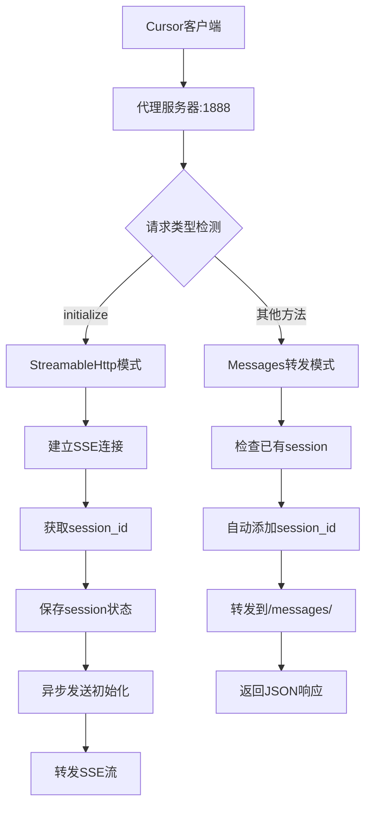

# LiteMCP Framework 完整使用指南

中文 | [English](USAGE.md)

## 🎯 概览

一个简单的 Model Context Protocol (MCP) 服务器框架，专为解决当前 MCP 服务器集群中节点分散、管理混乱、访问入口不统一等问题设计，提供简洁高效的工具开发与管控模式。

## 📋 目录

1. [快速开始](#-快速开始)
2. [代理服务器详解](#-代理服务器详解)
3. [完整命令列表](#-完整命令列表)
4. [配置文件](#-配置文件)
5. [传输模式详解](#-传输模式详解)
6. [开发新工具](#-开发新工具)
7. [项目结构](#-项目结构)
8. [常见操作场景](#-常见操作场景)
9. [故障排除](#-故障排除)
10. [常见问题](#-常见问题)

## 🚀 快速开始

### 5分钟上手LiteMCP

#### 1. 环境准备

**系统要求**：
- Python 3.12+
- 操作系统：Windows、macOS、Linux

**安装步骤**：
```bash
# 克隆项目
git clone https://github.com/stonehill-2345/lite-mcp
cd lite-mcp

# 安装依赖
poetry install

# 验证安装
./scripts/manage.sh check
```

#### 2. 最简单的启动方式（推荐）

**🎯 一键启动所有服务（包含代理服务器）**：
```bash
# 一键启动：代理服务器 + MCP服务器 + API服务器
./scripts/manage.sh up

# 查看服务器状态  
./scripts/manage.sh ps
```

#### 3. 配置MCP客户端

**http配置示例(需要以http模式启动mcp server)**：
```json
{
  "mcpServers": {
    "example-proxy-http": {
      "url": "http://{server ip}:1888/mcp/example",
      "description": "示例MCP服务器，演示基本功能 (通过代理HTTP访问)"
    },
    "school-proxy-http": {
      "url": "http://{server ip}:1888/mcp/school",
      "description": "学校管理MCP服务器，提供学生和课程管理功能 (通过代理HTTP访问)"
    },
    "school-http": {  // 不使用代理时则配置具体的http端口
        "url": "http://{server ip}:8765/mcp",
        "description": "学校管理MCP服务器，提供学生和课程管理功能 (通过代理HTTP访问)"
    }
  }
}
```
> 具体ip+端口根据自己server的实际情况修改。

**sse配置示例(需要以sse模式启动mcp server)**：
```json
{
  "mcpServers": {
    "example-proxy-sse": {
        "url": "http://{server ip}:1888/sse/example",
        "description": "示例MCP服务器，演示基本功能 (通过代理SSE访问)"
    },
    "school-proxy-sse": {
        "url": "http://{server ip}:1888/sse/school",
        "description": "学校管理MCP服务器，提供学生和课程管理功能 (通过代理SSE访问)"
    },
    "school-sse": {  // 不使用代理时则配置具体的sse端口
        "url": "http://{server ip}:8765/sse",
        "description": "学校管理MCP服务器，提供学生和课程管理功能 (通过代理SSE访问)"
    }
  }
}
```
> 具体ip+端口根据自己server的实际情况修改。无本地python环境情况下使用，sse属于长连接，出现中断的情况下需要client重新发起连接（以cursor为例：断开后需要重新刷新获取工具列表）。

**stdio配置示例(本地推荐，无需启动服务)**：
```json
{
    "mcpServers": {
        "example-stdio": {
            "command": "/Users/bab/devops/ai/litemcp/.venv/bin/python",
            "args": [
                "/Users/bab/devops/ai/litemcp/src/tools/demo/example_server.py"
            ],
            "env": {},
            "description": "示例MCP服务器，演示基本功能"
        },
        "school-stdio": {
            "command": "/Users/bab/devops/ai/litemcp/.venv/bin/python",
            "args": [
                "/Users/bab/devops/ai/litemcp/src/tools/demo/school_server.py"
            ],
            "env": {},
            "description": "学校管理MCP服务器，提供学生和课程管理功能"
        }
    }
}
```
> 具体路径根据自己server的实际情况修改。需要本地存在python环境，及对应mcp server代码。不存在断连情况，可一直保持使用。


详见[配置mcp-client示例](README.zh_CN.md#-配置mcp-client示例)。

**✨ 代理服务器的优势**：
- 🔗 **固定端口访问**：客户端配置一次，永不变更
- 🧠 **智能协议处理**：自动管理StreamableHttp复杂性
- 🔄 **session自动管理**：透明地处理session_id状态
- 🚀 **零配置体验**：MCP服务器自动注册到代理

## 🌟 代理服务器详解

### 为什么需要代理服务器？

**传统方式的问题**：
- 🔴 端口动态分配，客户端配置频繁变更
- 🔴 StreamableHttp协议复杂，需要手动管理session_id
- 🔴 每个MCP服务器都需要单独配置

**代理服务器解决方案**：
- ✅ 统一访问入口（固定端口1888）
- ✅ 智能协议处理（自动区分初始化和普通请求）
- ✅ 透明session管理（客户端无需关心session_id）
- ✅ 自动服务发现（MCP服务器自动注册）

### 🔧 架构原理

StreamableHttp处理流程:


### 🌐 访问路径规则

```
# 统一访问入口
http://{server ip}:1888/sse/{server_name}    -> 智能协议处理
http://{server ip}:1888/mcp/{server_name}/*  -> HTTP协议转发

# 管理接口
http://{server ip}:1888/proxy/status         -> 代理状态查询
http://{server ip}:1888/proxy/mapping        -> 服务器映射查询
http://{server ip}:1888/proxy/register       -> 手动注册服务器
```

### 🔧 代理服务器配置详解

#### 配置参数说明

| 参数 | 类型 | 说明 | 推荐值 |
|------|------|------|--------|
| `enabled` | boolean | 是否启用代理服务器 | `true` |
| `host` | string | 监听主机地址，"0.0.0.0"支持外网访问 | `"0.0.0.0"` |
| `port` | int | 代理服务器固定端口 | `1888` |
| `timeout` | int | HTTP请求超时时间（秒） | `30` |
| `connect_timeout` | int | 连接超时时间（秒） | `10` |
| `mcp_prefix` | string | MCP HTTP路径前缀 | `"mcp"` |
| `sse_prefix` | string | SSE路径前缀 | `"sse"` |

通过LiteMCP反向代理，您可以专注于MCP工具的业务逻辑开发，而无需担心复杂的协议细节和网络配置。

## 📋 启动方式详解

### 🚀 一键启动（推荐生产环境）

**超级简单的方式（推荐日常使用）**：
```bash
# 一键启动所有服务器（包括代理）
./scripts/manage.sh up

# 查看服务器状态  
./scripts/manage.sh ps

# 一键停止所有服务器
./scripts/manage.sh down

# 重启所有服务器
./scripts/manage.sh restart
```

### 🔧 单独启动（推荐开发调试）

**STDIO模式（本地开发，无需启动服务器）**：
```bash
# STDIO模式不需要启动服务器，直接配置MCP客户端即可
echo "STDIO模式：直接配置MCP客户端，无需预先启动服务器"
```

**HTTP模式（网络访问）**：
```bash
# 使用cli启动单个服务器 - Example服务器
python src/cli.py serve --server example --transport http

# 使用cli启动单个服务器 - School服务器  
python src/cli.py serve --server school --transport http

# 使用cli指定端口启动
python src/cli.py serve --server example --transport http --port 8001
```

**SSE模式（Web集成）**：
```bash
# 使用cli启动单个服务器 - Example服务器
python src/cli.py serve --server example --transport sse

# 使用cli启动单个服务器 - School服务器
python src/cli.py serve --server school --transport sse

# 使用cli指定端口启动
python src/cli.py serve --server example --transport sse --port 8002
```

### 📊 查看可用服务器

```bash
python src/cli.py list
```

预期输出：
```
┏━━━━━━━━━━━━┳━━━━━━━━━━━━━━━━━━━━━━━━━━━━━━━━━━━━━━┳━━━━━━━━━━━━━━━━━━━━━━━━━━━━━━┓
┃ 服务器     ┃ 描述                               ┃ 工具示例                     ┃
┡━━━━━━━━━━━━╇━━━━━━━━━━━━━━━━━━━━━━━━━━━━━━━━━━━━━━╇━━━━━━━━━━━━━━━━━━━━━━━━━━━━━━┩
│ example    │ 示例工具服务器 - 展示标准开发模式  │ add_numbers, multiply_numbers │
│ school     │ 学校管理服务器 - 学生信息管理      │ add_student, get_students     │
└────────────┴────────────────────────────────────┴──────────────────────────────┘
```

### 📈 传输模式选择指南

| 模式 | 启动方式 | 适用场景 | 配置复杂度 | 推荐使用 |
|------|----------|----------|------------|----------|
| **STDIO** | 无需启动服务器 | 本地开发、Claude Desktop、Cursor | ⭐ 简单 | 首次测试 |
| **HTTP** | `python src/cli.py serve --server <name> --transport http` | 网络部署、远程访问 | ⭐⭐ 中等 | API集成 |
| **SSE** | `python src/cli.py serve --server <name> --transport sse` | Web集成、浏览器连接 | ⭐⭐ 中等 | 实时应用 |
| **代理模式** | `./scripts/manage.sh up` | 生产部署、团队共享 | ⭐ 简单 | **🌟 强烈推荐** |

**💡 使用建议**：
- **本地使用**：推荐STDIO模式快速体验
- **团队协作**：使用代理模式，统一访问入口
- **生产部署**：使用代理模式 + `./scripts/manage.sh up`

## 📋 完整命令列表
### ⚡ 快速命令（推荐日常使用）

| 命令       | 功能              | 示例 |
|----------|-----------------|------|
| `up`     | 🚀 启动所有服务器      | `./scripts/manage.sh up` |
| `down`   | ⏹️ 停止所有服务器      | `./scripts/manage.sh down` |
| `reboot` | 🔄 重启所有服务器      | `./scripts/manage.sh reboot` |
| `ps`     | 📊 查看服务器状态      | `./scripts/manage.sh ps` |
| `log`    | 📝 查看日志信息       | `./scripts/manage.sh log` |
| `check`  | ❤️ 系统健康检查       | `./scripts/manage.sh check` |
| `clear`  | 🧹 清理临时文件       | `./scripts/manage.sh clear` |
| `conf`   | ⚙️ 查看配置信息       | `./scripts/manage.sh conf` |
| `api`    | 🚀 只启动API服务 | `./scripts/manage.sh api` |
| `proxy`  | 🚀 只启动代理服务      | `./scripts/manage.sh proxy` |

### 📋 详细命令（推荐脚本使用）

| 命令 | 功能 | 示例 |
|------|------|------|
| `start` | 启动所有服务器 | `./scripts/manage.sh start` |
| `stop` | 停止所有服务器 | `./scripts/manage.sh stop --force` |
| `restart` | 重启所有服务器 | `./scripts/manage.sh restart` |
| `status` | 查看服务器状态 | `./scripts/manage.sh status` |
| `install` | 安装/更新依赖 | `./scripts/manage.sh install` |
| `logs` | 查看日志列表 | `./scripts/manage.sh logs` |
| `clean` | 清理日志和PID文件 | `./scripts/manage.sh clean` |
| `health` | 系统健康检查 | `./scripts/manage.sh health` |
| `config` | 显示当前配置 | `./scripts/manage.sh config` |

### 🎯 指定服务器管理（新功能）

支持通过 `--name` 或 `-n` 参数指定要操作的单个服务器：

| 命令 | 功能 | 示例 |
|------|------|------|
| `up --name <服务器>` | 🚀 启动指定服务器 | `./scripts/manage.sh up --name example` |
| `down -n <服务器>` | ⏹️ 停止指定服务器 | `./scripts/manage.sh down -n school` |
| `reboot --name <服务器>` | 🔄 重启指定服务器 | `./scripts/manage.sh reboot --name pm` |
| `start -n <服务器>` | 启动指定服务器 | `./scripts/manage.sh start -n sonic` |
| `stop --name <服务器>` | 停止指定服务器 | `./scripts/manage.sh stop --name fastbot` |
| `restart -n <服务器>` | 重启指定服务器 | `./scripts/manage.sh restart -n example` |

#### 使用示例

```bash
# 启动指定服务器（两种格式等效）
./scripts/manage.sh up --name example
./scripts/manage.sh up -n example

# 停止指定服务器
./scripts/manage.sh down --name school
./scripts/manage.sh down -n school

# 重启指定服务器（开发时常用）
./scripts/manage.sh reboot --name school
./scripts/manage.sh restart -n school

# 启动所有服务器（保持原有功能）
./scripts/manage.sh up
```

#### 应用场景

1. **开发新服务**：添加新服务后只启动该服务进行测试
   ```bash
   ./scripts/manage.sh up --name my_new_server
   ```

2. **修改现有服务**：修改某个服务的代码后只重启该服务
   ```bash
   ./scripts/manage.sh reboot --name example
   ```

3. **调试特定服务**：需要调试某个服务时单独操作
   ```bash
   ./scripts/manage.sh down --name problematic_server
   ./scripts/manage.sh up --name problematic_server
   ```

4. **资源节约**：开发时不需要启动所有服务
   ```bash
   ./scripts/manage.sh up -n example  # 只启动需要的服务
   ```

### 选项参数

| 选项 | 功能 | 示例 |
|------|------|------|
| `--name, -n <服务名>` | 指定要操作的服务器名称 | `./scripts/manage.sh up --name example` |
| `--force` | 强制执行操作 | `./scripts/manage.sh stop --force` |
| `--verbose` | 显示详细输出（包括端口分配调试信息） | `./scripts/manage.sh up --verbose` |
| `--dry-run` | 只显示操作，不执行 | `./scripts/manage.sh start --dry-run` |

### 🔧 调试和故障排除命令

| 命令 | 功能 | 应用场景 | 示例 |
|------|------|----------|------|
| `up --verbose` | 启动并显示详细调试信息 | 排查启动失败、端口分配问题 | `./scripts/manage.sh up --verbose` |
| `start --verbose` | 启动时显示端口分配详情 | 调试端口冲突、IP获取问题 | `./scripts/manage.sh start --verbose` |
| `start --verbose -n <服务器>` | 调试特定服务器的启动过程 | 单个服务器故障排查 | `./scripts/manage.sh start --verbose -n example` |
| `diagnose` | 运行完整的系统诊断 | 环境问题、端口分配异常 | `./scripts/manage.sh diagnose` |

#### 详细模式功能说明

**`--verbose` 参数会显示以下调试信息**：
- **环境信息**：操作系统、Python版本、网络接口状态
- **端口分配过程**：智能端口分配的完整执行过程
- **模块导入状态**：Python模块加载和依赖检查
- **服务器配置**：每个服务器的详细配置参数
- **注册表操作**：服务器注册和清理的详细过程

**典型使用场景**：
1. **首次部署**：验证环境配置和依赖
   ```bash
   ./scripts/manage.sh up --verbose
   ```

2. **端口冲突排查**：查看端口分配逻辑
   ```bash
   ./scripts/manage.sh start --verbose -n example
   ```

3. **生产环境故障**：获取详细的错误信息
   ```bash
   ./scripts/manage.sh diagnose
   ```

4. **开发调试**：验证新服务器的配置
   ```bash
   ./scripts/manage.sh start --verbose -n my_new_server
   ```

### CLI命令（单独使用）

| 命令 | 功能 | 示例 |
|------|------|------|
| `python src/cli.py list` | 查看所有可用服务器 | `python src/cli.py list` |
| `python src/cli.py serve` | 启动单个服务器 | `python src/cli.py serve --server example` |
| `python src/cli.py health` | 系统健康检查 | `python src/cli.py health` |

## ⚙️ 配置文件

配置文件位于根目录 `config/servers.yaml`，定义了要启动的服务器：

```yaml
# LiteMCP 服务器启动配置
# 该配置文件定义了要启动的所有MCP服务器、代理服务器和API服务器

# 反向代理服务器配置
proxy_server:
  enabled: true                      # 是否启用代理服务器
  host: "0.0.0.0"                   # 绑定所有网卡，支持外网访问
  port: 1888                         # 代理服务器固定端口
  timeout: 30                        # HTTP请求超时时间
  connect_timeout: 10                # 连接超时时间
  mcp_prefix: "mcp"                  # MCP HTTP路径前缀
  sse_prefix: "sse"                  # SSE路径前缀
  description: "MCP反向代理服务器，支持StreamableHttp协议"

# MCP服务器配置
mcp_servers:
  example:
    enabled: true                    # 是否启用该服务器
    server_type: "example"           # 服务器类型（对应AVAILABLE_SERVERS的key）
    transport: "sse"                 # 传输协议: stdio/http/sse  
    host: null                       # 自动获取当前机器IP，外部可访问
    port: null                       # 端口号，null表示自动分配
    auto_restart: true               # 是否自动重启
    description: "示例服务器"

  school:
    enabled: true
    server_type: "school"
    transport: "sse"
    host: null                       # 自动获取当前机器IP，外部可访问
    port: null                       # 自动分配端口
    auto_restart: true
    description: "学校管理服务器"

# API服务器配置  
api_server:
  enabled: true                      # 是否启用API服务器
  host: null                         # 自动获取当前机器IP，外部可访问
  port: 9000                         # API服务器端口
  auto_restart: true                 # 是否自动重启
  description: "配置API服务器"

# 全局配置
global:
  project_name: "LiteMCP"            # 项目名称
  log_dir: "logs"                    # 日志目录
  pid_dir: "pids"                    # PID文件目录
  python_cmd: "python"               # Python命令
  max_startup_wait: 30               # 最大启动等待时间(秒)
  health_check_interval: 5           # 健康检查间隔(秒)
```

### 代理服务器配置说明

| 参数 | 类型 | 说明 | 推荐值 |
|------|------|------|--------|
| `enabled` | boolean | 是否启用代理服务器 | `true` |
| `host` | string | 监听主机地址，"0.0.0.0"支持外网访问 | `"0.0.0.0"` |
| `port` | int | 代理服务器固定端口 | `1888` |
| `timeout` | int | HTTP请求超时时间（秒） | `30` |
| `connect_timeout` | int | 连接超时时间（秒） | `10` |
| `mcp_prefix` | string | MCP HTTP路径前缀 | `"mcp"` |
| `sse_prefix` | string | SSE路径前缀 | `"sse"` |

### 自动IP获取功能

**新特性**：配置 `host: null` 时，系统会自动获取当前机器的IP地址，使服务器可以被外部访问。

**配置示例**：
```yaml
mcp_servers:
  example:
    host: null          # 自动获取机器IP，如 192.168.1.100
    port: null          # 自动分配端口，如 8001
```

**启动效果**：
```bash
./scripts/manage.sh up
# ✅ 自动获取到机器IP: 192.168.1.100
# ✅ 为服务器 example 分配端口: 8001
# ✅ example 启动成功 (PID: 12345)
...
```

**传统配置对比**：
```yaml
# 传统方式（仅本地访问）
host: "localhost"       # 只能本地访问
port: 8000             # 手动指定端口

# 新方式（外部可访问）
host: null             # 自动获取机器IP
port: null             # 自动分配端口
```

### 配置参数说明

| 参数 | 类型 | 说明 | 示例 |
|------|------|------|------|
| `enabled` | boolean | 是否启用该服务器 | `true` / `false` |
| `server_type` | string | 服务器类型，对应 `tools/__init__.py` 中的注册名 | `"example"` |
| `transport` | string | 传输协议 | `"stdio"` / `"http"` / `"sse"` |
| `host` | string/null | 监听主机地址，`null` 表示自动获取机器IP | `"localhost"` / `null` |
| `port` | int/null | 监听端口，`null` 表示自动分配 | `8000` / `null` |
| `auto_restart` | boolean | 是否自动重启（预留功能） | `true` |
| `description` | string | 服务器描述 | `"示例服务器"` |

## 🌐 传输模式详解

### STDIO模式

**特点**：
- 标准输入输出通信
- 无需启动服务器进程
- 适合本地开发和桌面应用

**使用场景**：
- Claude Desktop集成
- Cursor IDE集成
- 本地开发调试

**配置示例**：
```bash
# 无需预先启动，直接配置MCP客户端
python src/cli.py serve --server example  # 仅用于测试
```

### HTTP模式

**特点**：
- RESTful API接口
- 支持网络访问
- 标准HTTP协议

**使用场景**：
- 远程服务部署
- 微服务架构
- API集成

**启动示例**：
```bash
# 启动HTTP服务器（外部访问地址会自动显示）
python src/cli.py serve --server example --transport http

# 或使用管理脚本启动所有服务器
./scripts/manage.sh up
```

### SSE模式

**特点**：
- Server-Sent Events
- 实时数据推送
- Web友好

**使用场景**：
- Web应用集成
- 实时数据流
- 浏览器客户端

**启动示例**：
```bash
# 启动SSE服务器（外部访问地址会自动显示）
python src/cli.py serve --server example --transport sse

# 或使用管理脚本启动所有服务器
./scripts/manage.sh up
```

### 测试连接

启动MCP客户端后，你应该能看到：
- ✅ litemcp-example服务器连接成功
- ✅ 可用工具：add_numbers, multiply_numbers

在AI客户端中尝试：
```
请帮我计算 15 + 25
请计算 3.14 × 2
```

## 🛠️ 开发新工具

### 完整开发流程

以下是添加新工具的完整5步流程：

#### 第1步：创建服务器文件

在 `tools/` 目录下创建新的服务器文件，例如 `my_tool_server.py`：

```python
"""
我的自定义工具 - 描述你的工具功能
"""

# 简洁的导入 - 基础类会自动处理路径问题
try:
    from src.tools.base import BaseMCPServer
except ImportError:
    from src.tools.base import BaseMCPServer

class MyToolMCPServer(BaseMCPServer):
    """我的自定义工具服务器"""
    
    def __init__(self, name: str = "LiteMCP-MyTool"):
        # 调用父类初始化，自动获得所有传输模式支持
        super().__init__(name)
    
    def _register_tools(self):
        """实现工具注册 - 这是唯一需要实现的方法"""
        
        @self.mcp.tool()
        def my_function(input_text: str) -> str:
            """
            我的自定义工具函数
            
            Args:
                input_text: 输入文本
            
            Returns:
                处理后的结果
            """
            # 在这里实现你的工具逻辑
            return f"处理结果: {input_text}"

# 创建全局实例
my_tool_server = MyToolMCPServer()

if __name__ == "__main__":
    my_tool_server.run()
```

**🎯 极简开发模式**：
- ✅ 只需4行导入代码（自动处理路径）
- ✅ 自动获得STDIO、HTTP、SSE三种传输模式
- ✅ 统一的错误处理机制
- ✅ 专注于业务逻辑实现
- ✅ 复制 `tools/demo/example_server.py` 作为开发起点

#### 第2步：注册到框架

在 `tools/__init__.py` 中注册新服务器：

```python
# 在AVAILABLE_SERVERS字典中添加
"my_tool": {
    "description": "我的自定义工具",
    "module": "tools.my_tool_server", 
    "class": "MyToolMCPServer"
}

# 添加导入（如果需要直接导入）
from .my_tool_server import MyToolMCPServer

# 更新__all__列表（如果需要）
__all__ = [
    "AVAILABLE_SERVERS",
    "ExampleMCPServer",
    "MyToolMCPServer"  # 新增
]
```

**🚀 新特性：动态工具发现**
- ✅ **无需手动维护tools列表**：框架自动检测已注册的工具
- ✅ **实时更新**：工具列表与实际代码保持同步
- ✅ **减少维护负担**：只需实现 `_register_tools()` 方法即可

#### 第3步：配置启动参数

在 `servers.yaml` 中添加新服务器配置(如果需要使用manage.sh启动，在服务器部署推荐使用manage.sh)：

```yaml
mcp_servers:
  # ... 现有配置 ...
  
  my_tool:                           # 新增服务器
    enabled: true                    # 是否启用
    server_type: "my_tool"           # 对应注册表中的key
    transport: "sse"                 # 传输协议
    host: null                       # 自动获取机器IP
    port: null                       # 自动分配端口
    auto_restart: true
    description: "我的自定义工具"
```

**🚀 框架特性**：
- ✅ **动态服务器发现**：无需修改CLI代码，自动发现新服务器
- ✅ **配置驱动启动**：通过 `servers.yaml` 控制启动参数
- ✅ **零代码修改**：添加新服务器无需修改核心代码

#### 第4步：测试工具

```bash
# 查看新工具
python src/cli.py list

# 启动新服务器（单独测试，与servers.yaml配置无关）
python src/cli.py serve --server my_tool

# manage.sh具体启动哪些服务，以什么形式启动都由servers.yaml配置决定
# 批量启动（如果新配置的server的enabled为true则包含新服务器）
./scripts/manage.sh up

# 查看启动状态
./scripts/manage.sh ps

# 健康检查
./scripts/manage.sh check
```

#### 第5步：验证功能

**方式1：使用管理脚本（推荐）**
```bash
# 启动所有服务器（包括新工具）
./scripts/manage.sh up

# 查看服务器状态和访问地址
./scripts/manage.sh ps
```

**方式2：MCP客户端配置**
在MCP客户端配置中添加新工具：

```json
{
  "mcpServers": {
    "litemcp-my-tool": {
      "command": "python",
      "args": ["/path/to/litemcp/tools/my_tool_server.py"],
      "env": {}
    }
  }
}
```

### 开发最佳实践

1. **工具命名**：使用清晰、描述性的名称
2. **文档字符串**：为每个工具提供详细的描述、参数说明和返回值说明
3. **错误处理**：在工具函数中添加适当的异常处理
4. **类型提示**：使用Python类型提示提高代码可读性
5. **测试先行**：为工具编写单元测试
6. **配置优先**：优先使用 `servers.yaml` 配置，支持外部访问
7. **自动化测试**：使用 `./scripts/manage.sh up` 进行集成测试

## 📁 项目结构

启动后会自动创建以下目录：

```
litemcp/
├── config/                     # 配置文件目录
│   ├── servers.yaml            # 服务器配置文件
├── src/                        # 源代码目录
│   ├── cli.py                  # 命令行工具
│   ├── core/                   # 核心模块
│   │   ├── config.py           # 配置管理
│   │   ├── utils.py            # 工具函数（包含IP获取）
│   │   ├── registry.py         # 服务器注册表
│   │   ├── proxy_server.py     # 代理服务器核心
│   │   └── api_server.py       # API服务器核心
│   ├── controller/             # API控制器
│   │   ├── __init__.py         # 控制器包初始化
│   │   └── config_api.py       # FastAPI接口
│   └── tools/                  # MCP工具服务器
│       ├── __init__.py         # 服务器注册中心
│       ├── base.py             # 基础服务器类
│       └── demo/               # 自定义服务器目录
│           ├── example_server.py   # 示例服务器
│           ├── school_server.py    # 学校管理服务器
├── docs/                      # 文档目录
│   ├── USAGE.md               # 完整使用指南
├── runtime/                   # 运行时文件目录
│   ├── logs/                  # 日志文件
│   │   ├── example.log        # Example服务器日志
│   │   ├── school.log         # School服务器日志
│   │   └── api_server.log     # API服务器日志
│   ├── pids/                  # PID文件
│   │   ├── example.pid        # Example服务器PID
│   │   ├── school.pid         # School服务器PID
│   │   └── api_server.pid     # API服务器PID
│   ├── cache/                 # 缓存文件
│   └── registry.json          # 服务器注册表（运行时生成）
├── scripts/                   # 脚本目录
│   └── manage.sh              # 统一管理脚本
├── tests/                     # 测试目录
│   ├── test_tools/            # 工具测试
├── cli.py                     # CLI启动器（向后兼容）
├── manage.sh                  # 管理脚本启动器
├── pyproject.toml             # 项目配置
└── README.md                  # 项目说明
```

### 核心文件说明

- **`manage.sh`**: 统一管理脚本，支持快速和详细两种命令风格
- **`config/servers.yaml`**: 服务器配置文件，定义了要启动的服务器：
- **`src/cli.py`**: 命令行接口，提供服务器管理功能，支持动态导入
- **`src/tools/__init__.py`**: 服务器注册表，管理所有可用工具
- **`src/tools/base.py`**: 基础服务器类，提供统一的开发框架
- **`src/tools/demo/example_server.py`**: 示例服务器，演示基本实现模式
- **`src/core/config.py`**: 全局配置管理
- **`src/core/utils.py`**: 工具函数，包含自动IP获取功能
- **`src/core/proxy_server.py`**: 代理服务器核心，智能协议处理
- **`src/core/api_server.py`**: API服务器核心，配置管理接口
- **`runtime/registry.json`**: 运行时服务器注册表，自动维护

## 🔧 常见操作场景

### 场景1：开发环境启动

```bash
# 一键启动开发环境
./scripts/manage.sh up

# 查看所有服务器状态
./scripts/manage.sh ps

# 实时查看日志
tail -f logs/*.log
```

### 场景2：指定服务器开发（新功能）

```bash
# 开发新服务：只启动指定服务器进行测试
./scripts/manage.sh up --name my_new_server

# 修改现有服务：重启指定服务器
./scripts/manage.sh reboot --name example

# 调试特定服务：停止后重新启动
./scripts/manage.sh down --name problematic_server
./scripts/manage.sh up --name problematic_server

# 查看指定服务器状态
./scripts/manage.sh ps | grep example
```

### 场景3：生产环境部署

```bash
# 先安装依赖
poetry install

# 检查系统健康状况
./scripts/manage.sh check

# 启动所有服务器
./scripts/manage.sh start

# 验证服务器状态
./scripts/manage.sh status
```

**Docker部署**：
```dockerfile
FROM python:3.12-slim
COPY . /app
WORKDIR /app
RUN pip install -r requirements.txt
CMD ["./scripts/manage.sh", "up"]
```

### 场景4：服务器维护

```bash
# 更新单个服务器代码后重启
./scripts/manage.sh reboot --name pm

# 批量重启所有服务器
./scripts/manage.sh reboot

# 停止特定服务器进行维护
./scripts/manage.sh down --name sonic

# 维护完成后重新启动
./scripts/manage.sh up --name sonic
```

### 场景5：故障排查

```bash
# 查看系统健康状况
./scripts/manage.sh check

# 查看日志文件列表
./scripts/manage.sh log

# 查看特定服务器日志
tail -f logs/example.log

# 重启有问题的服务器
./scripts/manage.sh reboot --name example
```

### 场景6：清理和维护

```bash
# 停止所有服务器
./scripts/manage.sh down

# 清理日志和临时文件
./scripts/manage.sh clear

# 更新依赖
poetry install

# 重新启动
./scripts/manage.sh up
```

### 场景7：开发工作流（推荐）

```bash
# 1. 开发阶段：只启动需要的服务器
./scripts/manage.sh up --name example

# 2. 测试阶段：启动相关服务器
./scripts/manage.sh up --name school
./scripts/manage.sh up --name pm

# 3. 集成测试：启动所有服务器  
./scripts/manage.sh up

# 4. 代码修改后：重启特定服务器
./scripts/manage.sh reboot --name example

# 5. 发布前验证：检查所有服务状态
./scripts/manage.sh ps
./scripts/manage.sh check
```

### 场景8：单独启动特定服务器

```bash
# 启动单个服务器（STDIO模式）
python src/cli.py serve --server example

# 启动HTTP模式（网络访问）
python src/cli.py serve --server example --transport http

# 启动SSE模式（Web集成）
python src/cli.py serve --server example --transport sse
```

## 🚨 故障排除

### 🔧 代理服务器故障排除

#### 1. 代理服务器无法启动
**症状**：`./scripts/manage.sh up` 显示代理启动失败

**解决方案**：
```bash
# 检查端口占用
netstat -tulpn | grep 1888

# 强制清理端口
sudo kill $(sudo lsof -t -i:1888)

# 重新启动
./scripts/manage.sh down && ./scripts/manage.sh up
```

#### 2. MCP服务器注册失败
**症状**：代理状态显示 `"total_servers": 0`

**解决方案**：
```bash
# 手动重新注册
curl -X POST http://{server ip}:1888/proxy/register \
  -H "Content-Type: application/json" \
  -d '{"server_name": "example", "host": "{server ip}", "port": 8000}'

# 检查MCP服务器是否运行
curl http://{server ip}:8000/sse
```

#### 3. Cursor连接失败
**症状**：Cursor显示 "MCP error -32602: Invalid request parameters"

**解决方案**：
- 确保使用外网IP而不是localhost
- 检查代理服务器的session管理是否正常工作
- 查看代理日志获取详细错误信息

#### 4. StreamableHttp协议问题
**症状**：工具列表无法加载

**解决方案**：
```bash
# 查看代理详细日志
tail -f runtime/logs/proxy_server.log

# 检查session管理
curl http://{server ip}:1888/proxy/status | jq '.servers'
```

### 🔧 调试模式

**使用 `--verbose` 参数获取详细诊断信息**：
```bash
# 启动时启用详细模式（推荐首次使用）
./scripts/manage.sh up --verbose

# 调试特定服务器
./scripts/manage.sh start --verbose -n example

# 运行系统诊断
./scripts/manage.sh diagnose
```

**详细模式显示的信息**：
- 🔍 **环境检查**：Python版本、依赖状态、网络接口
- 🔧 **端口分配详情**：智能端口分配的完整执行过程
- 📊 **配置解析**：每个服务器的详细配置参数
- 🔄 **注册表操作**：服务器注册和清理的详细过程
- 🐛 **错误诊断**：详细的错误堆栈和建议解决方案

**传统调试方式**：
```bash
# 或者单独启动代理服务器调试
python src/cli.py proxy --host 0.0.0.0 --port 1888 --log-level DEBUG
```

### 🔍 通用故障排除

### 端口冲突
系统会自动分配可用端口，避免冲突。如果仍有问题：
```bash
./scripts/manage.sh down --force  # 强制停止所有服务器
./scripts/manage.sh up            # 重新启动
```

### 注册表问题
如果服务器状态显示异常：
```bash
# 系统会自动检测和修复注册表
./scripts/manage.sh up
# 或手动触发验证
./scripts/manage.sh ps
```

### IP获取失败
如果自动IP获取失败：
```yaml
# 在 servers.yaml 中手动指定IP
mcp_servers:
  example:
    host: "192.168.1.100"  # 手动指定IP
    # 或
    host: "localhost"      # 仅本地访问
```

### 服务器无法启动
```bash
# 查看详细日志
tail -f logs/[服务器名].log

# 检查系统健康状况
./scripts/manage.sh check

# 清理并重启
./scripts/manage.sh clear
./scripts/manage.sh up
```

### 权限问题
```bash
# 确保脚本有执行权限
chmod +x manage.sh

# 检查Python环境
python --version  # 需要 >= 3.12
```

### 🚀 自动配置生成

**从API获取配置**：
```bash
# 启动所有服务
./scripts/manage.sh up

# 获取Cursor配置
curl http://{server ip}:9000/config/cursor | jq .

# 获取Claude Desktop配置
curl http://{server ip}:9000/config/claude | jq .

# 获取代理模式配置（推荐）
curl http://{server ip}:9000/config/proxy | jq .
```

### 📊 配置验证

**测试连接**：
```bash
# 测试代理服务器
curl http://{server ip}:1888/proxy/status

# 测试具体服务器
curl -X POST http://{server ip}:1888/sse/example \
  -H "Content-Type: application/json" \
  -d '{"method":"tools/list","jsonrpc":"2.0","id":1}'
```

**在MCP客户端中验证**：
- ✅ 服务器连接成功
- ✅ 可以看到工具列表
- ✅ 工具调用正常返回结果

### 🔧 客户端配置故障排除

#### 连接失败
1. 检查服务状态：`./scripts/manage.sh ps`
2. 检查代理状态：`curl http://{server ip}:1888/proxy/status`
3. 验证IP地址是否正确（查看实际启动日志）

#### 工具不显示
1. 检查服务器注册：`curl http://{server ip}:1888/proxy/mapping`
2. 测试工具列表：上面的curl命令
3. 查看代理日志：`tail -f runtime/logs/proxy_server.log`

#### 配置更新
如果更改了服务器配置，重启并获取新地址：
```bash
./scripts/manage.sh reboot
./scripts/manage.sh ps  # 查看新地址
```

### 💡 最佳实践

1. **首选代理模式**：稳定、统一、易维护
2. **开发阶段**：可以先用STDIO模式快速验证
3. **生产部署**：必须使用代理模式，便于运维
4. **团队共享**：统一使用代理地址，避免各自配置
5. **监控检查**：定期检查代理状态确保服务正常

**推荐配置流程**：
```bash
# 1. 启动服务
./scripts/manage.sh up

# 2. 获取代理地址  
./scripts/manage.sh ps

# 3. 配置客户端使用代理地址
# 4. 验证连接和工具功能
```

## ❓ 常见问题

### Q: 如何添加新的工具服务器？
A: 按照 [开发新工具](#-开发新工具) 章节的5步流程，无需修改CLI代码！

### Q: 如何启动指定的单个服务器？
A: 使用 `--name` 或 `-n` 参数指定服务器名称：
```bash
# 启动指定服务器
./scripts/manage.sh up --name example
./scripts/manage.sh up -n school

# 重启指定服务器
./scripts/manage.sh reboot --name pm

# 停止指定服务器
./scripts/manage.sh down -n sonic
```

### Q: 指定服务器启动和全部启动有什么区别？
A: 
- **指定服务器启动**：只启动指定的MCP服务器，不启动代理和API服务器
- **全部启动**：启动代理服务器、所有启用的MCP服务器和API服务器
- **使用场景**：指定启动适合开发调试，全部启动适合生产环境

### Q: --name 和 -n 参数有什么区别？
A: 两者效果完全相同，都用于指定要操作的服务器名称：
- `--name`：长格式，更易读，适合脚本和文档
- `-n`：短格式，更简洁，适合交互式使用

### Q: 如果指定的服务器名称不存在会怎样？
A: 系统会显示错误信息并列出所有可用的服务器：
```bash
./scripts/manage.sh up --name nonexistent
# 输出：
# ❌ 服务器 'nonexistent' 不存在于配置中
# ℹ️ 可用的服务器：
#   - example (启用)
#   - school (启用)
#   - pm (禁用)
```

### Q: 指定服务器启动时使用什么端口？
A: 仍然使用智能端口分配机制，从8000开始自动分配可用端口，并显示实际的访问地址。

### Q: 为什么推荐使用代理模式？
A: 代理模式提供固定访问地址、智能协议处理、自动session管理和统一监控，大大简化了配置和维护工作。

### Q: 代理服务器的核心优势是什么？
A: 
- **固定端口访问**：客户端配置一次，永不变更（端口1888）
- **智能协议处理**：自动管理StreamableHttp复杂性，透明处理session_id
- **统一访问入口**：所有MCP服务器通过一个代理访问
- **自动服务发现**：MCP服务器启动时自动注册到代理
- **零配置体验**：服务器重启自动重新注册，无需手动干预

### Q: 如何让服务器支持外部访问？
A: 在 `config/servers.yaml` 中配置 `host: "0.0.0.0"`，代理服务器会自动绑定所有网卡。

### Q: 如何避免端口冲突？
A: 配置 `port: null`，系统会自动分配可用端口。代理使用固定端口1888。

### Q: StreamableHttp和SSE有什么区别？
A: StreamableHttp是Cursor使用的协议，SSE是标准的Server-Sent Events。代理服务器都支持，并智能处理协议差异。

### Q: 代理服务器如何处理session管理？
A: 
- 自动为每个server维护活跃session
- 透明地为客户端请求注入session_id
- 客户端无需关心session状态，代理自动处理

### Q: 如何诊断代理服务器问题？
A: 
1. 查看代理状态：`curl http://{server ip}:1888/proxy/status`
2. 检查服务器映射：`curl http://{server ip}:1888/proxy/mapping`
3. 查看代理日志：`tail -f runtime/logs/proxy_server.log`
4. 使用管理脚本：`./scripts/manage.sh check`

### Q: 代理服务器支持哪些管理接口？
A: 
- `GET /proxy/status` - 查看代理和所有服务器状态
- `GET /proxy/mapping` - 查看服务器映射关系
- `POST /proxy/register` - 手动注册服务器
- `DELETE /proxy/unregister/{name}` - 注销服务器

### Q: 服务器启动失败怎么办？
A: 
1. 检查日志：`tail -f runtime/logs/[服务器名].log`
2. 健康检查：`./scripts/manage.sh check`
3. 重启服务：`./scripts/manage.sh reboot`
4. 查看代理状态确认注册情况

### Q: 如何在不同传输模式间切换？
A: 修改 `config/servers.yaml` 中的 `transport` 参数，然后重启：`./scripts/manage.sh reboot`

### Q: 注册表文件是什么？
A: `registry.json` 是运行时生成的服务器状态文件，记录所有运行中服务器的信息，支持自动修复。

### Q: Poetry和pip哪个更好？
A: 管理脚本会自动检测并使用合适的包管理器，两者都支持。

### Q: 如何部署到生产环境？
A: 
1. 配置 `host: "0.0.0.0"` 支持外部访问
2. 使用 `./scripts/manage.sh up` 启动所有服务
3. 配置反向代理（如nginx）
4. 设置进程监控（如systemd）

### Q: 开发新工具还需要修改CLI吗？
A: **不需要！** 现在使用动态导入机制，只需在 `tools/__init__.py` 注册即可。

### Q: 代理模式和直连模式的性能差异？
A: 代理模式增加了一层转发，但性能影响微乎其微。而且代理提供的智能协议处理和session管理带来的稳定性远超过微小的性能开销。

### Q: 如何自定义代理服务器配置？
A: 修改 `config/servers.yaml` 中的 `proxy_server` 部分：
```yaml
proxy_server:
  enabled: true
  host: "0.0.0.0"          # 监听地址
  port: 1888               # 监听端口
  timeout: 30              # 请求超时
  connect_timeout: 10      # 连接超时
  mcp_prefix: "mcp"        # HTTP路径前缀
  sse_prefix: "sse"        # SSE路径前缀
``` 

### Q: 开发时什么场景使用指定服务器启动？
A: 
- **开发新功能**：只启动相关服务器，节省资源
- **调试问题**：隔离问题服务器，便于排查
- **代码修改**：修改特定服务器后，只重启该服务器
- **功能测试**：测试特定功能时，只启动必要的服务器

### 如何利用AI生成MCP工具提供给AI形成闭环？
生成问题示例：
```text
1、现在有一个get接口（运行测试任务）：
curl 'https://test-server.tech.cn/server/api/controller/testSuites/runSuite?id=43&strike=litemcp'
2、参数解释：
- id: 需要运行的任务ID，不能为空
- strike: 可以硬编码，无需修改固定为litemcp
3、不要在具体工具以外添加一些局限性注释信息，我们的server后续还会扩展其他工具能力
4、参考 @example_server.py 在  @sonic_server.py  实现一下这个mcp server，并根据 @USAGE.md 中 《## 🛠️ 开发新工具》章节的说明注册配置这个mcp server
```
后续按照文档[本地启动mcp server](README.zh_CN.md#-开发指南)

### Q: `--verbose` 参数有什么作用？何时使用？
A: `--verbose` 参数启用详细调试模式，显示完整的启动和端口分配过程信息：

**适用场景**：
- **首次部署**：验证环境配置和依赖是否正确
- **端口冲突排查**：查看智能端口分配的详细过程
- **启动失败诊断**：获取详细的错误信息和堆栈
- **开发调试**：验证新服务器的配置和启动流程
- **生产环境故障**：获取完整的系统状态信息

**显示内容**：
- 🔍 环境信息（操作系统、Python版本、网络接口）
- 🧩 模块导入状态（Python依赖检查）
- 🔧 端口分配详情（智能端口分配过程）
- 📊 服务器配置（详细的配置参数解析）
- 🔄 注册表操作（服务器注册和清理过程）

### Q: 详细模式下日志太多，如何筛选关键信息？
A: 详细模式已经优化过日志输出，只显示关键步骤：

**正常运行时**：只显示关键的端口分配步骤和结果
**出现错误时**：显示完整的错误堆栈和调试信息

如果仍觉得信息过多，可以使用：
```bash
# 启动时重定向详细日志到文件
./scripts/manage.sh up --verbose 2>&1 | tee startup-debug.log

# 筛选关键错误信息
./scripts/manage.sh up --verbose 2>&1 | grep -E "(❌|ERROR|FAILED)"

# 只看端口分配结果
./scripts/manage.sh up --verbose 2>&1 | grep -E "(端口分配结果|最终分配端口)"
```

### Q: 系统诊断命令 `diagnose` 和 `--verbose` 有什么区别？
A: 两者用途不同：

**`--verbose` 参数**：
- 在正常启动过程中显示详细信息
- 适用于启动时的实时调试
- 重点关注启动流程和端口分配

**`diagnose` 命令**：
- 专门的系统诊断工具，不影响正在运行的服务
- 全面检查系统环境、依赖、网络状态
- 提供故障排除建议和修复方案
- 适用于排查现有环境问题

推荐使用策略：
- **日常开发**：使用 `--verbose` 进行启动调试
- **环境问题**：使用 `diagnose` 进行系统诊断
- **生产故障**：两者结合使用，全面排查问题
