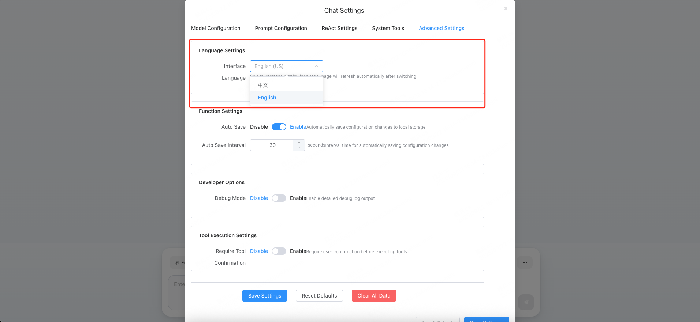
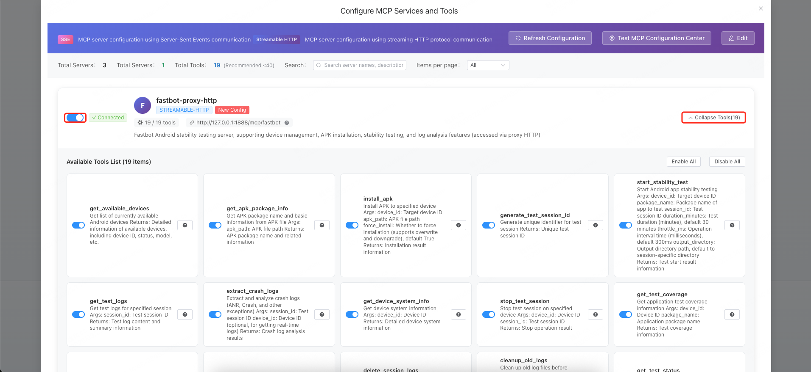
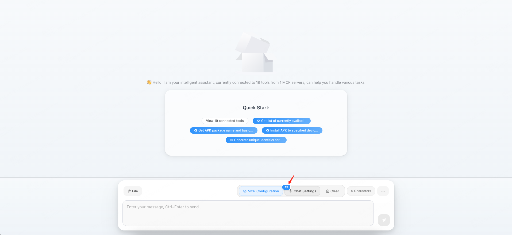

English | [中文](docs/README.zh_CN.md)

# Intelligent Assistant

## Overview

The Intelligent Assistant is an AI system based on the ReAct (Reasoning + Acting) pattern that solves complex tasks through deep reasoning and tool invocation. It provides multiple prompt templates and intelligent functions.

## Quick Start
```bash
npm install
npm run dev
```

## Getting Started

### Language Settings


### Configure Model
> Using deepseek as an example.

Operation Path: Click on chat settings -> Model Configuration -> Select "Custom" as the model provider -> Enter the model API key -> Enter the model name -> Enter the base URL for deepseek calls -> Adjust the maximum token count as needed based on the context length supported by the model you are using


### Prompt
> Can be adjusted as needed, generally no need to adjust

Operation Path: Click on chat settings -> Prompt Configuration


### System Tools
> Can be adjusted as needed, generally no need to adjust

The following 3 system tools are provided by default:
- mcp_reconnect: Reconnect MCP server -> When the enabled mcp tools encounter exceptions, the model can attempt to self-heal the enabled mcp connection status
- get_datetime: Get the current date and time, supports multiple formats and timezone conversions, can be used for time-related queries and calculations
- execute_code: Execute JavaScript code in a secure sandbox environment, supports common programming tasks such as mathematical calculations, string processing, JSON operations, and array processing
> mcp_reconnect and get_datetime are enabled by default, you can enable more or disable all as needed.


### Configure MCP Tools
> Can be adjusted as needed to configure the MCP services you need, can be SSE or Streamable HTTP MCP provided by the LiteMCP server itself or external services.

#### Configure MCP provided by LiteMCP
Operation Path: MCP Configuration -> Configuration Center -> Search for the required keywords to find the MCP configuration you need -> Click add to assistant -> Enable MCP server -> Enable or disable tools in the MCP server as needed -> Can be normally used by our model


> Note: Filter and add based on actual needs, this is just an example. Only supports adding sse or Streamable HTTP to the web assistant.


> Enable or disable MCP server and tools in the server as needed.

#### Configure MCP provided by external services
> Note: Only supports adding sse or Streamable HTTP to the web assistant.

Operation Path: MCP Configuration -> Edit -> Fill in the MCP configuration according to the example -> Save -> Enable MCP server -> Enable or disable tools in the MCP server as needed -> Can be normally used by our model

Example:
```json
{
  "mcpServers": {
    "school-sse-test": {
      "type": "streamable-http",
      "url": "http://127.0.0.1:1888/mcp/school",
      "description": "School management MCP server (SSE mode test, may require special configuration)"
    }
  }
}
```

### Use MCP with AI
> After the necessary AI model and MCP (if MCP is not needed, no configuration is required) have been configured, it can be used directly.

If MCP server+tools are enabled, the number of enabled tools can be seen on the chat page:


Start using:


## 🌐 Web Frontend Development

LiteMCP provides a modern web interface built on Vue 3 + Vite.

### 🚀 Quick Start Frontend

#### Method One: Using Convenient Script (Recommended)

```bash
# Enter frontend directory
cd web

# Linux/macOS
./start.sh

# Windows
start.bat
```

**Convenient script features**:
- ✅ Automatically check Node.js environment (requires version 16+)
- ✅ Automatically install frontend dependencies
- ✅ Check backend service status
- ✅ Start development server
- ✅ Provide friendly error messages

#### Method Two: Manual Start

```bash
# Enter frontend directory
cd web

# Install dependencies
npm install

# Start development server
npm run dev

# Build production version
npm run build

# Preview production build
npm run preview
```

### 🛠️ Frontend Technology Stack

- **Vue 3** - Progressive JavaScript framework
- **Vite** - Fast build tool
- **Element Plus** - Vue 3 component library
- **Axios** - HTTP client
- **Sass** - CSS preprocessor

### 📱 Feature Highlights

- **MCP Configuration Center** - Visual management of MCP server configurations
- **Tool Statistics Panel** - Real-time view of tool usage statistics
- **Intelligent Chat Interface** - AI conversation based on the ReAct pattern
- **Responsive Design** - Supports desktop and mobile devices

### 🔧 Development Configuration

The frontend automatically proxies API requests to the backend service:

```javascript
// Proxy configuration in vite.config.js
server: {
  port: 2345,
  host: '0.0.0.0'
  // API requests directly connect to http://localhost:9000
}
```

### 📂 Frontend Directory Structure

```
web/
├── components/           # Vue components
│   ├── chat/            # Chat-related components
│   ├── config/          # Configuration-related components
│   ├── dialog/          # Dialog components
│   └── mcp/             # MCP-related components
├── services/            # Business services
│   ├── chat/            # Chat service
│   ├── config/          # Configuration service
│   └── mcp/             # MCP service
├── utils/               # Utility functions
├── api/                 # API encapsulation
│   └── mcp/             # MCP API
├── constants/           # Constant definitions
├── package.json         # Dependency configuration
├── vite.config.js       # Build configuration
├── index.html           # HTML template
└── main.js              # Application entry
```