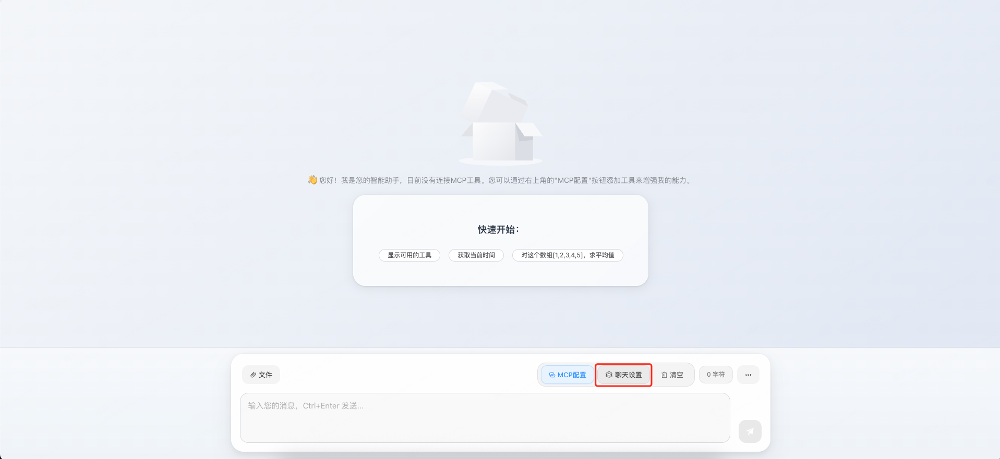

中文 | [English](../README.md)


# 智能助手

## 概述

智能助手是一个基于ReAct（Reasoning + Acting）模式的AI系统，通过深度推理和工具调用来解决复杂任务。提供了多种提示词模板和智能化功能。

## 快速开始
```bash
npm install
npm run dev
```

## 开始使用
### 配置模型
> 以deepseek为例。

操作路径：点击聊天设置 -> 模型配置 -> 模型提供商选择“自定义” -> 输入模型API key -> 输入模型名称 -> 输入deepseek调用的基础URL -> 可根据自己使用的模型支持的上下文长度按需调整最大令牌数



### 提示词
> 可按需调整，一般不需要调整

操作路径：点击聊天设置 -> 提示词配置


### 系统工具
> 可按需调整，一般不需要调整

当前默认提供了以下3个系统工具：
- mcp_reconnect：重新连接MCP server -> 当已启用的mcp tools调用异常时可让模型尝试自愈启用的mcp连接状态
- get_datetime：获取当前日期时间，支持多种格式和时区转换，可用于时间相关的查询和计算
- execute_code：在安全的沙箱环境中执行JavaScript代码，支持数学计算、字符串处理、JSON操作、数组处理等常见编程任务
> mcp_reconnect、get_datetime处于默认启用状态，可按需启用更多或直接全部关闭。


### 配置MCP工具
> 可按需调整配置自己需要用到的MCP服务，可以是[LiteMCP](../README.md)自身服务端提供的SSE或Streamable HTTP MCP也可以是外部其他服务提供的SSE或Streamable HTTP MCP。

#### 配置由LiteMCP提供的MCP
操作路径：MCP配置 -> 配置中心 -> 搜索需要的关键字找到自己需要的MCP配置 -> 点击添加到助手 -> 启用MCP server -> 可按需启用禁用MCP server中的部分工具 -> 即可正常提供给我们的模型使用了


> 注：根据实际情况筛选添加，这里只做示例。且仅支持将sse或Streamable HTTP添加到web助手中使用。


> 根据实际需要启用/禁用MCP server和Server中的工具。

#### 配置由外部提供的MCP
> 注：仍只支持将sse或Streamable HTTP添加到web助手中使用。

操作路径：MCP配置 -> 编辑 -> 根据示例填写MCP配置 -> 保存 -> 启用MCP server -> 可按需启用禁用MCP server中的部分工具 -> 即可正常提供给我们的模型使用了

例：
```json
{
  "mcpServers": {
    "school-sse-test": {
      "type": "streamable-http",
      "url": "http://127.0.0.1:1888/mcp/school",
      "description": "学校管理MCP服务器 (SSE模式测试，可能需要特殊配置)"
    }
  }
}
```

### 结合AI使用MCP
> 在前面的必要AI模型、MCP(如果不需要用到MCP可以不配置)已经配置完成的情况下就可以直接使用了。

如果已经启用MCP server+工具在聊天页可以看到已启用的工具数量：


正式开始使用：


## 🌐 Web前端开发

LiteMCP提供了现代化的Web界面，基于Vue 3 + Vite构建。

### 🚀 快速启动前端

#### 方式一：使用便捷脚本（推荐）

```bash
# 进入前端目录
cd web

# Linux/macOS
./start.sh

# Windows
start.bat
```
**便捷脚本功能**：
- ✅ 自动检查Node.js环境（需要16+版本）
- ✅ 自动安装前端依赖
- ✅ 检查后端服务状态
- ✅ 启动开发服务器
- ✅ 提供友好的错误提示

#### 方式二：手动启动

```bash
# 进入前端目录
cd web

# 安装依赖
npm install

# 启动开发服务器
npm run dev

# 构建生产版本
npm run build

# 预览生产构建
npm run preview
```

### 🛠️ 前端技术栈

- **Vue 3** - 渐进式JavaScript框架
- **Vite** - 快速的构建工具
- **Element Plus** - Vue 3组件库
- **Axios** - HTTP客户端
- **Sass** - CSS预处理器

### 📱 功能特性

- **MCP配置中心** - 可视化管理MCP服务器配置
- **工具统计面板** - 实时查看工具使用统计
- **智能聊天界面** - 基于ReAct模式的AI对话
- **响应式设计** - 支持桌面和移动设备

### 🔧 开发配置

前端会自动代理API请求到后端服务：

```javascript
// vite.config.js 中的代理配置
server: {
  port: 2345,
  host: '0.0.0.0'
  // API请求直接连接到 http://localhost:9000
}
```

### 📂 前端目录结构

```
web/
├── components/           # Vue组件
│   ├── chat/            # 聊天相关组件
│   ├── config/          # 配置相关组件
│   ├── dialog/          # 对话框组件
│   └── mcp/             # MCP相关组件
├── services/            # 业务服务
│   ├── chat/            # 聊天服务
│   ├── config/          # 配置服务
│   └── mcp/             # MCP服务
├── utils/               # 工具函数
├── api/                 # API封装
│   └── mcp/             # MCP API
├── constants/           # 常量定义
├── package.json         # 依赖配置
├── vite.config.js       # 构建配置
├── index.html           # HTML模板
└── main.js              # 应用入口
```
